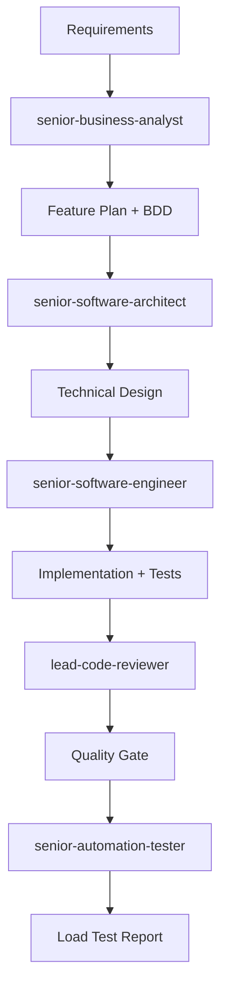
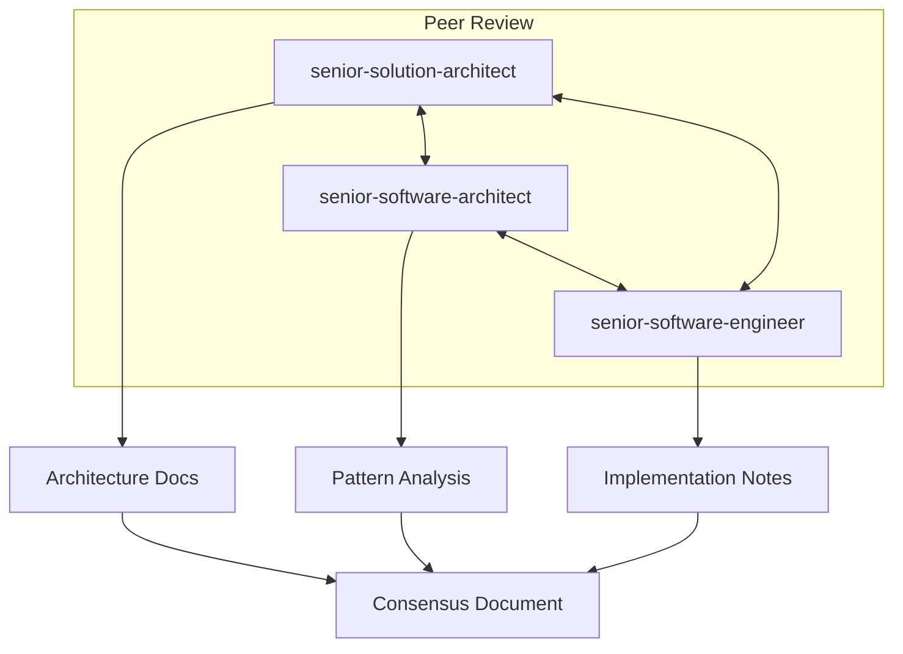

# GitHub Copilot Custom Instructions

## Overview

This repository implements a comprehensive **Multi-Agent AI System** designed to support the full Software Development Lifecycle (SDLC). The system uses specialized agents, orchestration instructions, and domain-specific prompts to handle architecture documentation, planning, implementation, code review, and testing.

## System Architecture

```
┌─────────────────────────────────────────────────────────────────────────┐
│                         ORCHESTRATION LAYER                             │
│  ┌──────────────────────────┐    ┌──────────────────────────────────┐  │
│  │  HIVE_Hierarchical       │    │  TEAM_Mesh                       │  │
│  │  (Sequential Tasks)      │    │  (Collaborative Tasks)           │  │
│  └──────────────────────────┘    └──────────────────────────────────┘  │
└─────────────────────────────────────────────────────────────────────────┘
                                    │
                    ┌───────────────┼───────────────┐
                    ▼               ▼               ▼
┌─────────────────────────────────────────────────────────────────────────┐
│                           AGENT LAYER                                   │
│  ┌─────────────────┐  ┌─────────────────┐  ┌─────────────────────────┐ │
│  │ Solution        │  │ Software        │  │ Business               │ │
│  │ Architect       │  │ Architect       │  │ Analyst                │ │
│  │ (C4, UML)       │  │ (Patterns)      │  │ (BDD, Requirements)    │ │
│  └─────────────────┘  └─────────────────┘  └─────────────────────────┘ │
│  ┌─────────────────┐  ┌─────────────────┐  ┌─────────────────────────┐ │
│  │ Software        │  │ Code            │  │ Automation             │ │
│  │ Engineer        │  │ Reviewer        │  │ Tester                 │ │
│  │ (TDD)           │  │ (Quality)       │  │ (Load Testing)         │ │
│  └─────────────────┘  └─────────────────┘  └─────────────────────────┘ │
└─────────────────────────────────────────────────────────────────────────┘
                                    │
                    ┌───────────────┼───────────────┐
                    ▼               ▼               ▼
┌─────────────────────────────────────────────────────────────────────────┐
│                          PROMPT LAYER                                   │
│  ┌────────────────────┐  ┌────────────────────┐  ┌──────────────────┐  │
│  │ typescript-nestjs  │  │ plantuml-diagrams  │  │ bdd-tdd-testing  │  │
│  └────────────────────┘  └────────────────────┘  └──────────────────┘  │
│  ┌────────────────────┐  ┌────────────────────┐  ┌──────────────────┐  │
│  │ code-quality-review│  │ architecture-      │  │ load-testing-k6  │  │
│  │                    │  │ patterns           │  │                  │  │
│  └────────────────────┘  └────────────────────┘  └──────────────────┘  │
└─────────────────────────────────────────────────────────────────────────┘
```

## Quick Reference

### Available Agents

| Agent | Expertise | Use When |
|-------|-----------|----------|
| `senior-solution-architect` | C4, UML, architecture extraction | Documenting system architecture |
| `senior-software-architect` | Design patterns, algorithms | Analyzing code patterns |
| `senior-business-analyst` | BDD, requirements, user stories | Planning new features |
| `senior-software-engineer` | TDD, implementation | Building features |
| `lead-code-reviewer` | Quality, security, SonarQube | Code review |
| `senior-automation-tester` | K6, API testing, load testing | Testing |

### Orchestration Models

| Model | Topology | Use When |
|-------|----------|----------|
| `HIVE_Hierarchical` | Tree | Sequential tasks with dependencies |
| `TEAM_Mesh` | Mesh | Collaborative problem-solving |

## Usage Examples

### 1. Architecture Documentation

```
@workspace Use the senior-solution-architect agent with HIVE_Hierarchical 
instruction to extract and document the system architecture with C4 diagrams.
```

**Expected Output:**
- Context diagram (PlantUML)
- Container diagram (PlantUML)
- Component diagrams for key modules
- Architecture Decision Records (ADRs)

### 2. Design Pattern Analysis

```
@workspace Invoke senior-software-architect to analyze and document 
all design patterns used in this codebase.
```

**Expected Output:**
- Pattern catalog with locations
- Class diagrams showing pattern implementation
- Best practices documentation

### 3. Feature Planning (BDD)

```
@workspace As senior-business-analyst, create a feature plan for 
implementing user authentication with OAuth2, using BDD methodology.
```

**Expected Output:**
- Feature file with Gherkin scenarios
- User stories with acceptance criteria
- Technical requirements document

### 4. TDD Implementation

```
@workspace Using senior-software-engineer with TDD methodology, 
implement the user authentication feature based on the BDD scenarios.
```

**Expected Output:**
- Failing test cases (Red)
- Implementation code (Green)
- Refactored code (Refactor)

### 5. Code Review

```
@workspace Invoke lead-code-reviewer to review the authentication 
implementation for quality, security (OWASP), and SonarQube compliance.
```

**Expected Output:**
- Code review checklist
- Security vulnerability report
- Refactoring recommendations

### 6. Load Testing

```
@workspace Use senior-automation-tester to create K6 load test 
scripts for the authentication endpoints.
```

**Expected Output:**
- K6 test scripts
- Performance thresholds
- CI/CD integration config

## Orchestration Workflows

### Full Feature Development (HIVE)



### Collaborative Architecture Review (TEAM)



## Configuration

### Agent Selection Criteria

1. **Architecture Tasks** → Solution/Software Architect
2. **Planning Tasks** → Business Analyst
3. **Coding Tasks** → Software Engineer
4. **Quality Tasks** → Code Reviewer
5. **Testing Tasks** → Automation Tester

### Orchestration Selection

1. **Linear/Sequential** → HIVE_Hierarchical
2. **Iterative/Collaborative** → TEAM_Mesh
3. **Mixed workflows** → Combine as needed

## Project-Specific Context

### NestJS Framework

This repository is the **NestJS core framework** - a progressive Node.js framework for building efficient, reliable, and scalable server-side applications.

**Key Characteristics:**
- Monorepo with Lerna (9 packages)
- TypeScript-first
- Decorators and metadata reflection
- Dependency Injection (IoC)
- Modular architecture

**When analyzing this codebase:**
- Focus on `packages/` for core framework code
- Use `sample/` for usage examples
- Reference `integration/` for test patterns

### Code Style Standards

- ESLint + Prettier
- Mocha + Chai for testing
- TypeDoc for documentation
- Conventional Commits

## Extending the System

### Adding New Agents

1. Create file: `.github/agents/<role>-<domain>.agent.md`
2. Follow template in `.github/agents/INSTRUCTION.md`
3. Update this file with agent details

### Adding New Prompts

1. Create file: `.github/prompts/<domain>-<expertise>.prompt.md`
2. Follow template in `.github/prompts/INSTRUCTION.md`
3. Reference in relevant agents

### Adding New Instructions

1. Create file: `.github/instructions/<model>_<topology>.instruction.md`
2. Follow template in `.github/instructions/INSTRUCTION.md`
3. Document workflow patterns

## Support

For issues or enhancements to the multi-agent system:
1. Check existing agents and prompts
2. Review INSTRUCTION.md files for guidance
3. Follow naming conventions strictly
4. Test with sample tasks before deployment
