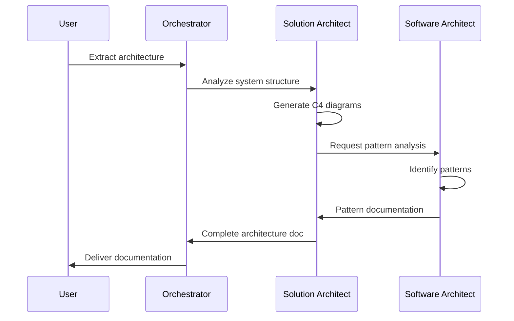
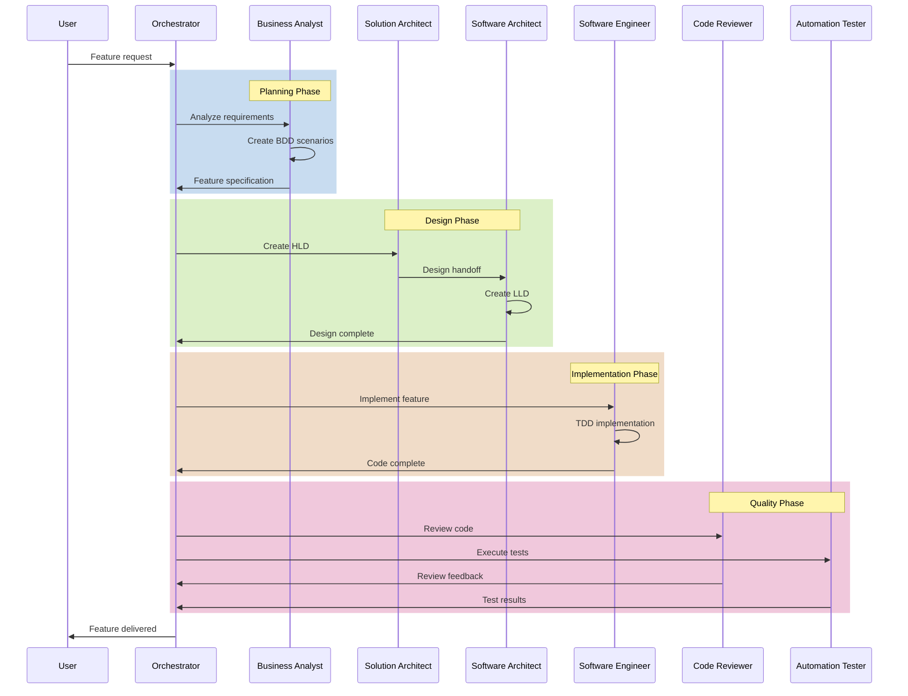
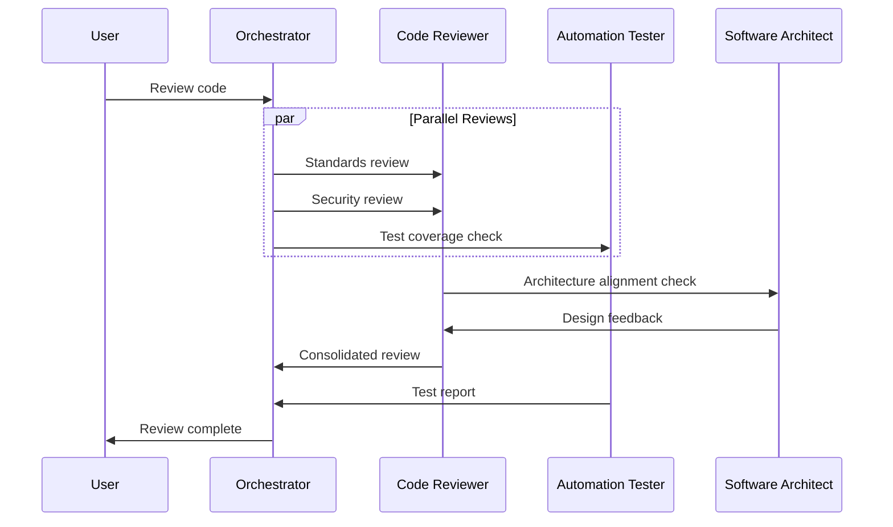

# HIVE Hierarchical Multi-Agent Orchestrator

## Overview
This instruction defines a **Hierarchical (HIVE)** multi-agent system with a **tree topology** for managing complex software development lifecycle tasks. The orchestrator coordinates specialized agents to complete end-to-end workflows.

## System Architecture

```
                    ┌─────────────────────────┐
                    │   HIVE Orchestrator     │
                    │   (Task Coordinator)    │
                    └───────────┬─────────────┘
                                │
        ┌───────────────┬───────┴───────┬───────────────┐
        │               │               │               │
        ▼               ▼               ▼               ▼
┌───────────────┐ ┌───────────────┐ ┌───────────────┐ ┌───────────────┐
│  Architecture │ │   Planning    │ │ Development   │ │   Quality     │
│     Wing      │ │     Wing      │ │     Wing      │ │     Wing      │
└───────┬───────┘ └───────┬───────┘ └───────┬───────┘ └───────┬───────┘
        │               │               │               │
        ▼               ▼               ▼               ▼
┌───────────────┐ ┌───────────────┐ ┌───────────────┐ ┌───────────────┐
│ Solution      │ │ Business      │ │ Software      │ │ Code          │
│ Architect     │ │ Analyst       │ │ Engineer      │ │ Reviewer      │
├───────────────┤ └───────────────┘ └───────────────┘ ├───────────────┤
│ Software      │                                     │ Automation    │
│ Architect     │                                     │ Tester        │
└───────────────┘                                     └───────────────┘
```

## Task Routing Matrix

| Task Type | Primary Agent | Supporting Agents |
|-----------|---------------|-------------------|
| Architecture Extraction | Solution Architect | Software Architect |
| Pattern Analysis | Software Architect | Solution Architect |
| Feature Planning | Business Analyst | Solution Architect |
| Design (HLD) | Solution Architect | Software Architect |
| Design (LLD) | Software Architect | Business Analyst |
| Implementation | Software Engineer | Software Architect |
| Code Review | Code Reviewer | Software Architect |
| Testing | Automation Tester | Software Engineer |
| Security Review | Code Reviewer | Automation Tester |
| Performance Testing | Automation Tester | Solution Architect |

## Workflow Definitions

### Workflow 1: Architecture Documentation
**Trigger**: Request to extract/document architecture



**Steps**:
1. Solution Architect analyzes codebase structure
2. Generates C4 Context and Container diagrams
3. Software Architect analyzes design patterns
4. Solution Architect creates Component diagrams
5. Both collaborate on sequence diagrams
6. Final documentation assembled

### Workflow 2: Feature Development (Full Cycle)
**Trigger**: New feature request



**Steps**:
1. **Planning Phase** (Business Analyst)
   - Analyze requirements
   - Create user stories with acceptance criteria
   - Define BDD scenarios
   - Document NFRs

2. **Design Phase** (Architects)
   - Solution Architect creates HLD
   - Software Architect creates LLD
   - Define interfaces and contracts
   - Create technical diagrams

3. **Implementation Phase** (Software Engineer)
   - Write tests first (TDD)
   - Implement code
   - Create documentation
   - Self-review

4. **Quality Phase** (Reviewer + Tester)
   - Code review (standards, security, performance)
   - Execute functional tests
   - Run performance tests
   - Validate NFRs

### Workflow 3: Code Quality Assessment
**Trigger**: Code review request or PR



## Task Templates

### Architecture Extraction Task
```yaml
task: architecture_extraction
input:
  scope: full | module:<name> | feature:<name>
  output_types:
    - c4_diagrams
    - sequence_diagrams
    - class_diagrams
    - pattern_analysis
  format: plantuml
workflow:
  - agent: solution_architect
    action: analyze_structure
  - agent: software_architect
    action: analyze_patterns
  - agent: solution_architect
    action: generate_diagrams
  - agent: solution_architect
    action: compile_documentation
output:
  - architecture_document.md
  - diagrams/*.puml
```

### Feature Planning Task
```yaml
task: feature_planning
input:
  title: "<Feature Title>"
  description: "<Description>"
  priority: high | medium | low
workflow:
  - agent: business_analyst
    action: analyze_requirements
  - agent: business_analyst
    action: create_user_stories
  - agent: business_analyst
    action: define_acceptance_criteria
  - agent: solution_architect
    action: assess_impact
output:
  - feature_specification.md
  - bdd_scenarios.feature
```

### Implementation Task
```yaml
task: implementation
input:
  design_doc: "<path to LLD>"
  acceptance_criteria: "<path to BDD>"
  scope:
    create: [files]
    modify: [files]
workflow:
  - agent: software_engineer
    action: write_tests
  - agent: software_engineer
    action: implement_code
  - agent: software_engineer
    action: verify_tests
  - agent: code_reviewer
    action: review_code
  - agent: automation_tester
    action: execute_tests
output:
  - source_files
  - test_files
  - implementation_report.md
```

## Quality Gates

### Gate 1: Planning Complete
- [ ] User stories defined
- [ ] Acceptance criteria complete
- [ ] NFRs documented
- [ ] Dependencies identified

### Gate 2: Design Complete
- [ ] HLD approved
- [ ] LLD reviewed
- [ ] Interfaces defined
- [ ] Design patterns documented

### Gate 3: Implementation Complete
- [ ] All tests written and passing
- [ ] Code coverage >= 80%
- [ ] Documentation updated
- [ ] Self-review complete

### Gate 4: Quality Approved
- [ ] Code review passed
- [ ] No critical issues
- [ ] Security scan clean
- [ ] Performance targets met

## Communication Protocol

### Task Handoff Format
```yaml
handoff:
  from_agent: <source_agent>
  to_agent: <target_agent>
  task_id: <unique_id>
  context:
    summary: "<what was done>"
    artifacts:
      - <artifact1>
      - <artifact2>
    decisions:
      - <decision1>
      - <decision2>
    open_items:
      - <item1>
  expected_output:
    - <output1>
    - <output2>
```

### Status Update Format
```yaml
status:
  task_id: <unique_id>
  agent: <agent_name>
  status: in_progress | blocked | complete
  progress: <percentage>
  current_step: "<step description>"
  blockers:
    - <blocker1>
  next_steps:
    - <step1>
```

## Escalation Rules

| Condition | Action |
|-----------|--------|
| Agent blocked > 5 min | Escalate to Orchestrator |
| Quality gate failed | Return to previous phase |
| Conflicting requirements | Escalate to User |
| Technical uncertainty | Consult higher-level architect |

## Usage

### Initialize Orchestrator
```
@orchestrator Initialize HIVE workflow for: <task description>
```

### Check Status
```
@orchestrator Status of current workflow
```

### Override Agent Selection
```
@orchestrator Assign <task> to <specific_agent>
```
