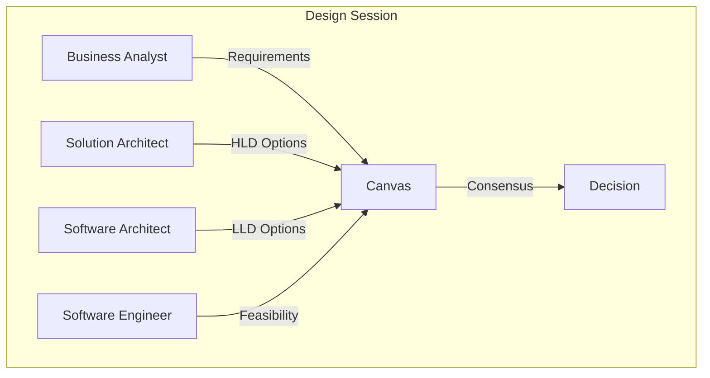
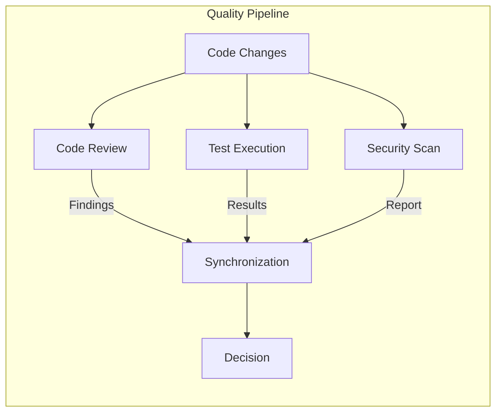
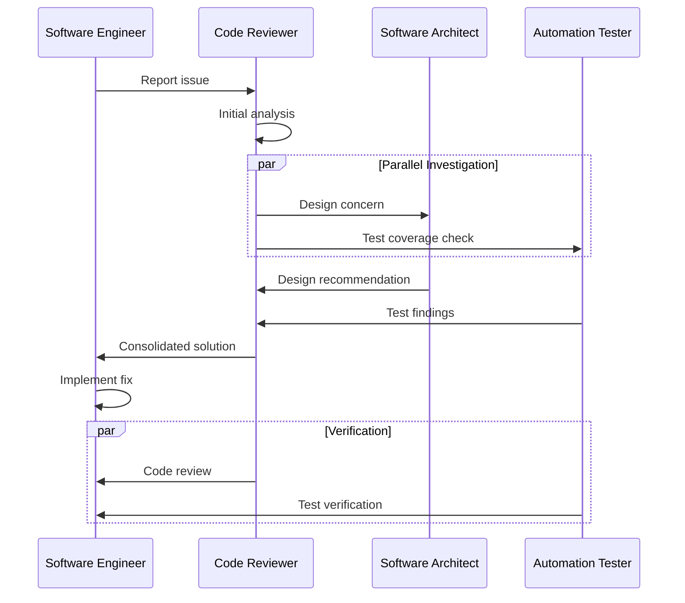

# TEAM Mesh Collaborative Multi-Agent System

## Overview
This instruction defines a **TEAM** multi-agent system with a **Mesh topology** for collaborative development tasks. Agents work as peers with continuous communication and shared responsibilities.

## System Architecture

```
            ┌─────────────────────────────────────────┐
            │         TEAM Mesh Network               │
            │                                         │
            │   ┌─────────┐     ┌─────────┐          │
            │   │Solution │◄───►│Software │          │
            │   │Architect│     │Architect│          │
            │   └────┬────┘     └────┬────┘          │
            │        │    ╲   ╱     │                │
            │        │     ╲ ╱      │                │
            │        ▼      ╳       ▼                │
            │   ┌────┴────┐╱ ╲┌────┴────┐           │
            │   │Business │◄───►Software│           │
            │   │Analyst  │    │Engineer│           │
            │   └────┬────┘     └────┬────┘          │
            │        │    ╲   ╱     │                │
            │        │     ╲ ╱      │                │
            │        ▼      ╳       ▼                │
            │   ┌────┴────┐╱ ╲┌────┴────┐           │
            │   │  Code   │◄───►Automation│         │
            │   │Reviewer │    │ Tester  │          │
            │   └─────────┘     └─────────┘          │
            │                                         │
            └─────────────────────────────────────────┘
```

## Collaboration Patterns

### Pattern 1: Pair Problem Solving
Two agents collaborate on complex problems:

```yaml
collaboration:
  type: pair
  agents:
    - solution_architect
    - software_architect
  mode: synchronous
  communication: direct
  use_cases:
    - Complex architecture decisions
    - Trade-off analysis
    - Pattern selection
```

### Pattern 2: Review Circle
Multiple agents review work in sequence:

```yaml
collaboration:
  type: circle
  agents:
    - software_engineer  # Creates
    - code_reviewer      # Reviews code
    - automation_tester  # Reviews tests
    - software_architect # Reviews design
  mode: sequential
  communication: handoff
  use_cases:
    - Code reviews
    - Design reviews
    - Test reviews
```

### Pattern 3: Brainstorm Session
All relevant agents contribute ideas:

```yaml
collaboration:
  type: brainstorm
  agents: all_relevant
  mode: parallel
  communication: shared_canvas
  use_cases:
    - Solution exploration
    - Problem analysis
    - Architecture decisions
```

## Communication Channels

### Direct Communication
Agent-to-agent for specific queries:

```yaml
message:
  from: software_engineer
  to: software_architect
  type: query
  content: |
    Need clarification on interface design for UserService.
    Should we use abstract class or interface?
  context:
    file: src/users/users.service.ts
    line: 45
  priority: normal
```

### Broadcast Communication
One-to-many for announcements:

```yaml
broadcast:
  from: code_reviewer
  to: team
  type: announcement
  content: |
    Found security vulnerability pattern in multiple files.
    Please review the security guidelines before next commit.
  artifacts:
    - security_findings.md
  action_required: true
```

### Shared Canvas
Collaborative workspace for complex problems:

```yaml
canvas:
  topic: "Authentication Architecture"
  participants:
    - solution_architect
    - software_architect
    - software_engineer
  content:
    requirements:
      - Multi-tenant support
      - OAuth2 + JWT
      - Session management
    proposals:
      - proposal_1: "Centralized auth service"
      - proposal_2: "Per-tenant auth modules"
    discussion:
      - point_1: "Scalability considerations"
      - point_2: "Security implications"
    decision: pending
```

## Team Workflows

### Workflow 1: Collaborative Design
All architects and engineer collaborate on design:



### Workflow 2: Continuous Integration
Parallel quality checks with synchronization:



### Workflow 3: Problem Resolution
Team collaborates to resolve issues:



## Role Responsibilities in Team Context

### Solution Architect (Team Lead for Architecture)
- Leads architectural discussions
- Makes final architecture decisions
- Coordinates with external stakeholders
- Reviews major design changes

### Software Architect (Technical Lead)
- Leads technical design sessions
- Guides pattern selection
- Reviews implementation approaches
- Mentors engineers on design

### Business Analyst (Requirements Coordinator)
- Clarifies requirements during implementation
- Updates specifications based on discoveries
- Facilitates stakeholder communication
- Tracks requirement changes

### Software Engineer (Implementation Lead)
- Leads implementation discussions
- Identifies technical challenges early
- Proposes implementation alternatives
- Coordinates with testers

### Code Reviewer (Quality Coordinator)
- Leads code quality standards
- Coordinates review activities
- Tracks quality metrics
- Facilitates knowledge sharing

### Automation Tester (Test Coordinator)
- Leads test strategy discussions
- Coordinates test coverage
- Tracks test metrics
- Facilitates test reviews

## Consensus Building

### Decision Protocol
```yaml
decision:
  topic: "<decision topic>"
  options:
    - option_a: 
        description: "Description"
        pros: [...]
        cons: [...]
        votes: []
    - option_b:
        description: "Description"
        pros: [...]
        cons: [...]
        votes: []
  required_voters:
    - solution_architect
    - software_architect
    - software_engineer
  consensus_threshold: 2/3
  timeout: "30 min"
  escalation: "solution_architect decides"
```

### Conflict Resolution
```yaml
conflict:
  type: technical | process | priority
  parties:
    - agent_1
    - agent_2
  description: "<conflict description>"
  resolution_path:
    1: "Direct discussion between parties"
    2: "Bring in third agent for perspective"
    3: "Escalate to solution_architect"
    4: "Escalate to user/stakeholder"
```

## Shared Artifacts

### Living Documentation
Agents collaboratively maintain:

```yaml
shared_docs:
  - architecture_decisions.md:
      owners: [solution_architect, software_architect]
      contributors: all
  - coding_standards.md:
      owners: [code_reviewer]
      contributors: [software_engineer, software_architect]
  - test_strategy.md:
      owners: [automation_tester]
      contributors: [software_engineer, code_reviewer]
  - api_contracts.md:
      owners: [software_architect]
      contributors: [software_engineer, business_analyst]
```

### Knowledge Base
Team-shared learnings:

```yaml
knowledge_base:
  patterns:
    - name: "Repository Pattern"
      added_by: software_architect
      used_in: [users, cats, orders]
      notes: "Standard data access pattern"
  
  gotchas:
    - issue: "TypeORM lazy loading pitfall"
      discovered_by: software_engineer
      solution: "Use eager loading or explicit joins"
      
  best_practices:
    - practice: "Always validate DTOs"
      enforced_by: code_reviewer
      automated: true
```

## Team Metrics

### Collaboration Health
```yaml
metrics:
  communication:
    messages_per_task: avg
    response_time: avg
    unresolved_queries: count
  
  quality:
    review_iterations: avg
    defects_found_in_review: count
    test_coverage_trend: trend
  
  efficiency:
    cycle_time: avg
    rework_rate: percentage
    first_pass_rate: percentage
```

## Usage

### Start Team Session
```
@team Start collaborative session for: <task description>
```

### Request Peer Input
```
@team Need input from <role> on: <question>
```

### Call Team Meeting
```
@team Sync meeting: <agenda>
Participants: <roles>
```

### Share Finding
```
@team broadcast: <finding>
Relevant to: <roles>
```
