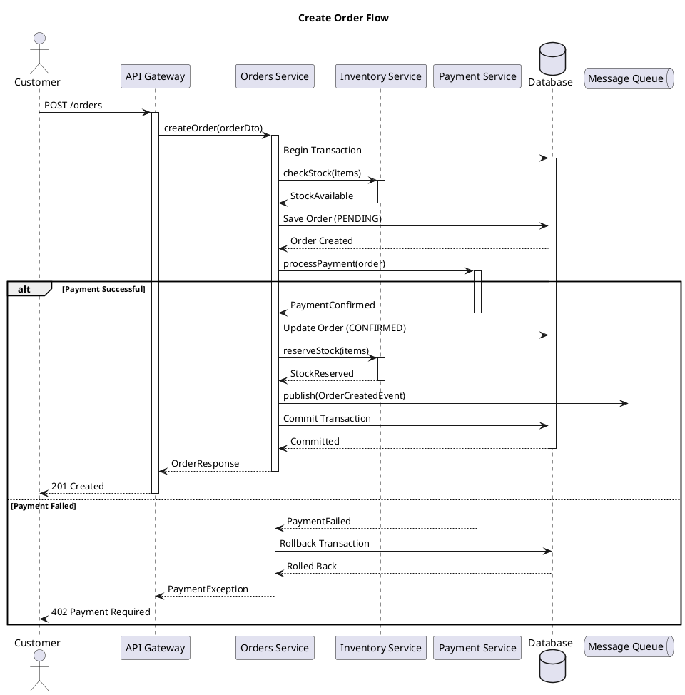
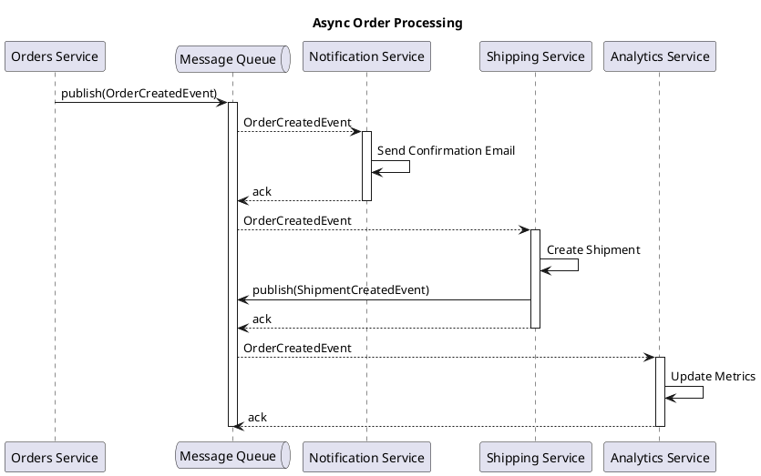
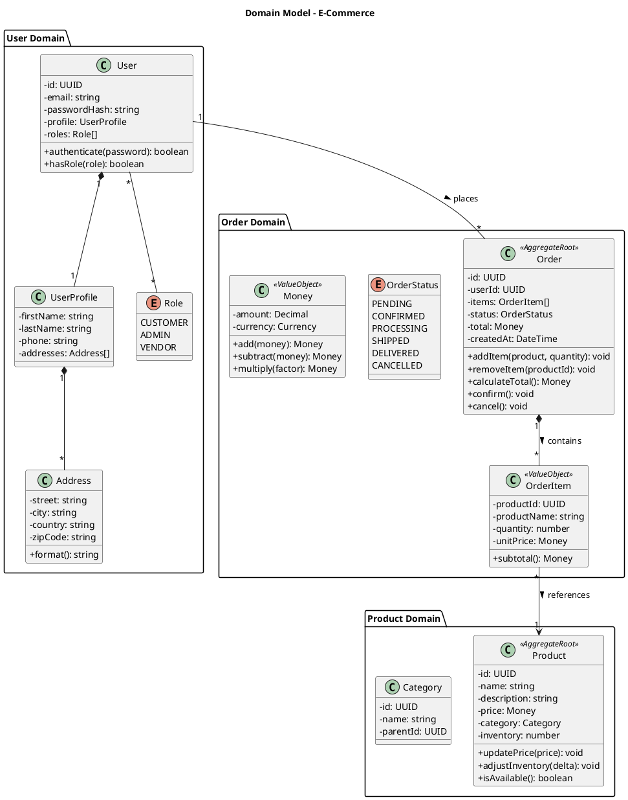
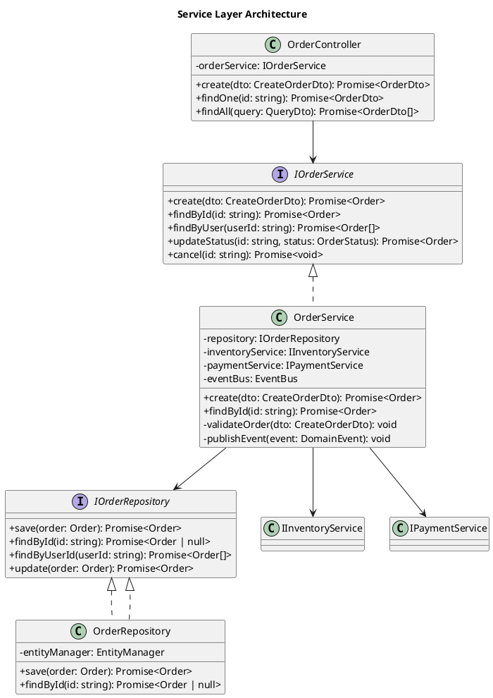
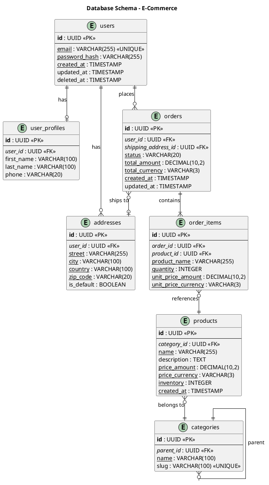
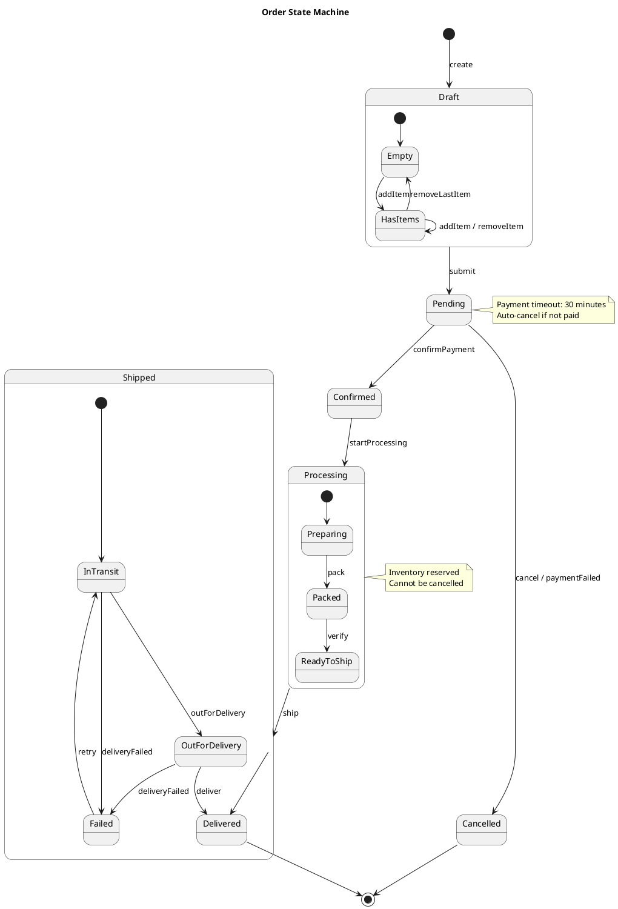
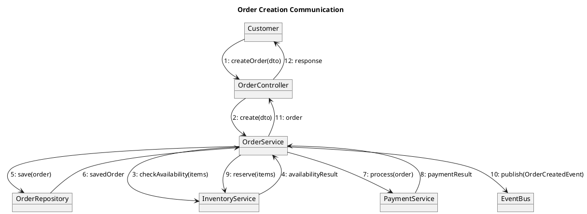
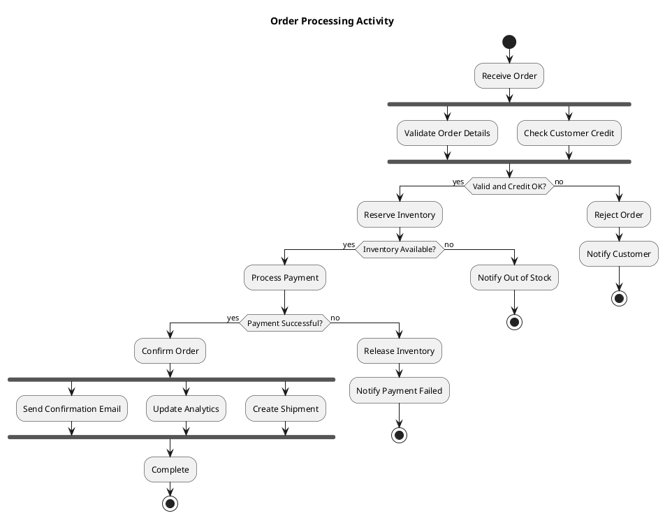

# PlantUML Diagrams Expertise

## Overview
This prompt provides comprehensive expertise in creating UML diagrams using PlantUML syntax, including C4 model diagrams, sequence diagrams, class diagrams, ERD diagrams, state machines, and more.

## C4 Model Diagrams

### C4 Context Diagram
```plantuml
@startuml C4_Context
!include https://raw.githubusercontent.com/plantuml-stdlib/C4-PlantUML/master/C4_Context.puml

LAYOUT_WITH_LEGEND()

title System Context Diagram - E-Commerce Platform

Person(customer, "Customer", "A user who wants to buy products")
Person(admin, "Admin", "System administrator")

System(ecommerce, "E-Commerce Platform", "Allows customers to browse and purchase products")

System_Ext(payment, "Payment Gateway", "Processes payments")
System_Ext(shipping, "Shipping Service", "Handles delivery")
System_Ext(email, "Email Service", "Sends notifications")

Rel(customer, ecommerce, "Uses", "HTTPS")
Rel(admin, ecommerce, "Manages", "HTTPS")
Rel(ecommerce, payment, "Processes payments", "HTTPS/REST")
Rel(ecommerce, shipping, "Creates shipments", "HTTPS/REST")
Rel(ecommerce, email, "Sends emails", "SMTP")

@enduml
```

### C4 Container Diagram
```plantuml
@startuml C4_Container
!include https://raw.githubusercontent.com/plantuml-stdlib/C4-PlantUML/master/C4_Container.puml

LAYOUT_WITH_LEGEND()

title Container Diagram - E-Commerce Platform

Person(customer, "Customer", "A user who wants to buy products")

System_Boundary(ecommerce, "E-Commerce Platform") {
    Container(spa, "Web Application", "Angular", "Delivers the web front-end")
    Container(mobile, "Mobile App", "React Native", "Mobile front-end")
    Container(api, "API Gateway", "NestJS", "Routes and validates requests")
    Container(users, "Users Service", "NestJS", "Manages user accounts")
    Container(catalog, "Catalog Service", "NestJS", "Product catalog management")
    Container(orders, "Orders Service", "NestJS", "Order processing")
    Container(cart, "Cart Service", "NestJS", "Shopping cart management")
    ContainerDb(db, "Database", "PostgreSQL", "Stores application data")
    ContainerQueue(queue, "Message Queue", "RabbitMQ", "Async messaging")
    Container(cache, "Cache", "Redis", "Caching layer")
}

System_Ext(payment, "Payment Gateway", "External payment processor")

Rel(customer, spa, "Uses", "HTTPS")
Rel(customer, mobile, "Uses", "HTTPS")
Rel(spa, api, "Calls", "HTTPS/REST")
Rel(mobile, api, "Calls", "HTTPS/REST")
Rel(api, users, "Routes to", "gRPC")
Rel(api, catalog, "Routes to", "gRPC")
Rel(api, orders, "Routes to", "gRPC")
Rel(api, cart, "Routes to", "gRPC")
Rel(users, db, "Reads/Writes", "TCP")
Rel(catalog, db, "Reads/Writes", "TCP")
Rel(orders, db, "Reads/Writes", "TCP")
Rel(orders, queue, "Publishes", "AMQP")
Rel(cart, cache, "Reads/Writes", "TCP")
Rel(orders, payment, "Processes", "HTTPS")

@enduml
```

### C4 Component Diagram
```plantuml
@startuml C4_Component
!include https://raw.githubusercontent.com/plantuml-stdlib/C4-PlantUML/master/C4_Component.puml

LAYOUT_WITH_LEGEND()

title Component Diagram - Orders Service

Container_Boundary(orders, "Orders Service") {
    Component(controller, "Orders Controller", "NestJS Controller", "REST API endpoints")
    Component(service, "Orders Service", "NestJS Service", "Business logic")
    Component(repository, "Orders Repository", "TypeORM Repository", "Data access")
    Component(validator, "Order Validator", "Class Validator", "Input validation")
    Component(mapper, "Order Mapper", "Class Transformer", "DTO mapping")
    Component(events, "Event Publisher", "Event Emitter", "Domain events")
    Component(saga, "Order Saga", "NestJS CQRS", "Order workflow")
}

ContainerDb(db, "PostgreSQL", "Database")
ContainerQueue(queue, "RabbitMQ", "Message Queue")
Container(inventory, "Inventory Service", "Stock management")
Container(payment, "Payment Service", "Payment processing")

Rel(controller, validator, "Validates with")
Rel(controller, service, "Uses")
Rel(service, repository, "Uses")
Rel(service, mapper, "Maps with")
Rel(service, events, "Publishes")
Rel(repository, db, "Reads/Writes")
Rel(events, queue, "Sends to")
Rel(saga, inventory, "Reserves stock")
Rel(saga, payment, "Processes payment")

@enduml
```

## Sequence Diagrams

### Basic Sequence Diagram


### Async Message Flow


## Class Diagrams

### Domain Model


### Service Layer


## ERD Diagrams

### Database Schema


## State Machine Diagrams

### Order State Machine


## Communication Diagrams

### Object Communication


## Activity Diagrams

### Order Processing Flow


## Best Practices

### Diagram Organization
1. Use consistent naming conventions
2. Include legends and titles
3. Use appropriate colors for different element types
4. Keep diagrams focused (one concept per diagram)
5. Use notes for important clarifications

### C4 Model Guidelines
1. Context → Container → Component → Code (zoom levels)
2. Each diagram should stand alone
3. Include all relevant systems/containers
4. Show data flow directions
5. Use standard C4 notation

### Sequence Diagram Tips
1. Show only relevant interactions
2. Use activation bars for clarity
3. Include alt/opt/loop fragments
4. Number messages for complex flows
5. Show async messages with open arrowheads

## References
- [PlantUML Documentation](https://plantuml.com/guide)
- [C4 Model](https://c4model.com)
- [C4-PlantUML](https://github.com/plantuml-stdlib/C4-PlantUML)
