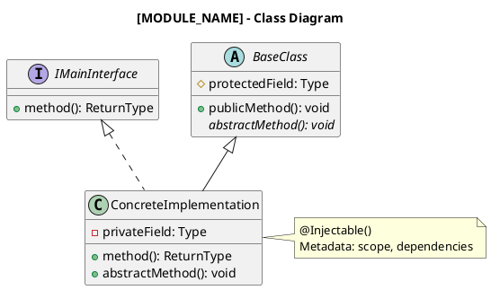

# NestJS Module Architecture Documentation Template

## Module Overview: [MODULE_NAME]

### Package Information
- **Package**: `@nestjs/[package-name]`
- **Location**: `packages/[package-name]/`
- **Version**: [version from package.json]
- **Purpose**: [High-level purpose description]

---

## Architecture Diagram (C4 Container)

```plantuml
@startuml NestJS_Module_Container
!include https://raw.githubusercontent.com/plantuml-stdlib/C4-PlantUML/master/C4_Container.puml

title [MODULE_NAME] - Container Diagram

Person(developer, "Developer", "Uses NestJS")

System_Boundary(nestjs, "NestJS Framework") {
    Container(common, "@nestjs/common", "TypeScript", "Decorators, interfaces, utilities")
    Container(core, "@nestjs/core", "TypeScript", "DI container, module system")
    Container(module, "@nestjs/[module-name]", "TypeScript", "[Module purpose]")
    
    ContainerDb(metadata, "Metadata", "reflect-metadata", "Decorator metadata storage")
}

System_Ext(platform, "Platform Adapter", "Express/Fastify")

Rel(developer, module, "Uses", "TypeScript")
Rel(module, common, "Depends on", "Import")
Rel(module, core, "Depends on", "Import")
Rel(module, metadata, "Reads/Writes", "Reflect API")
Rel(core, platform, "Adapts to", "Abstraction")
@enduml
```

---

## Component Structure (C4 Component)

```plantuml
@startuml NestJS_Module_Components
!include https://raw.githubusercontent.com/plantuml-stdlib/C4-PlantUML/master/C4_Component.puml

title [MODULE_NAME] - Component Diagram

Container_Boundary(module, "@nestjs/[module-name]") {
    Component(decorators, "Decorators", "TypeScript", "Metadata attachment")
    Component(interfaces, "Interfaces", "TypeScript", "Type definitions")
    Component(classes, "Core Classes", "TypeScript", "Implementation")
    Component(utils, "Utilities", "TypeScript", "Helper functions")
}

Rel(decorators, interfaces, "Defines types for")
Rel(classes, interfaces, "Implements")
Rel(classes, utils, "Uses")
Rel(decorators, classes, "Configures")
@enduml
```

---

## Class Diagram



---

## Module Dependencies

### Internal Dependencies (within @nestjs)
| Package | Imported Symbols | Purpose |
|---------|------------------|---------|
| `@nestjs/common` | Injectable, Type, ... | Core decorators and types |
| `@nestjs/core` | ModuleRef, Injector, ... | DI system integration |

### External Dependencies
| Package | Version | Purpose |
|---------|---------|---------|
| `reflect-metadata` | ^0.2.2 | Metadata reflection |
| `rxjs` | ^7.8.2 | Observable patterns |

### Dependency Graph
```
@nestjs/[module-name]
  ├── @nestjs/common (internal)
  ├── @nestjs/core (internal)
  ├── reflect-metadata (external)
  └── [other-deps] (external)
```

---

## Key Design Patterns

### 1. [Pattern Name - e.g., Decorator Pattern]
**Location**: `[file-path]`

**Purpose**: [What problem does it solve?]

**Implementation**:
```typescript
// Example code snippet
export function MyDecorator(): MethodDecorator {
  return (target, key, descriptor) => {
    Reflect.defineMetadata('my-key', value, target, key);
    return descriptor;
  };
}
```

**Usage**:
```typescript
class Example {
  @MyDecorator()
  method() {}
}
```

### 2. [Pattern Name - e.g., Factory Pattern]
**Location**: `[file-path]`

**Purpose**: [What problem does it solve?]

**Implementation**:
```typescript
// Factory implementation
```

---

## Public API Surface

### Exported Decorators
| Decorator | Signature | Purpose | Example |
|-----------|-----------|---------|---------|
| `@DecoratorName()` | `(options?) => Decorator` | [Purpose] | `@DecoratorName({ key: value })` |

### Exported Classes
| Class | Type | Purpose | Usage |
|-------|------|---------|-------|
| `ClassName` | Injectable/Controller/etc. | [Purpose] | `new ClassName()` or via DI |

### Exported Interfaces
| Interface | Properties | Purpose |
|-----------|------------|---------|
| `InterfaceName` | `field: Type` | [Purpose] |

### Exported Constants
| Constant | Type | Value | Purpose |
|----------|------|-------|---------|
| `CONSTANT_NAME` | Type | value | [Purpose] |

---

## Metadata System

### Metadata Keys Used
| Key | Stored On | Type | Purpose |
|-----|-----------|------|---------|
| `'metadata-key'` | Class/Method/Property | Type | [What it stores] |

### Metadata Flow
```
Decorator Applied
  → Metadata Attached (reflect-metadata)
    → Framework Reads Metadata (core/injector)
      → Behavior Configured
```

---

## Testing Strategy

### Unit Tests
**Location**: `packages/[package-name]/**/*.spec.ts`

**Coverage**: [Current coverage %]

**Test Structure**:
```typescript
import { expect } from 'chai';
import { Test, TestingModule } from '@nestjs/testing';
import { MyService } from './my.service';

describe('MyService', () => {
  let service: MyService;

  beforeEach(async () => {
    const module: TestingModule = await Test.createTestingModule({
      providers: [MyService],
    }).compile();

    service = module.get<MyService>(MyService);
  });

  it('should be defined', () => {
    expect(service).to.exist;
  });
});
```

### Integration Tests
**Location**: `integration/[feature-name]/`

**Test Scenarios**:
- [ ] Module initialization
- [ ] Dependency injection
- [ ] Error handling
- [ ] Platform compatibility (Express/Fastify)

---

## Performance Considerations

### Initialization Overhead
- [Time/memory impact during module init]

### Runtime Performance
- [Impact on request processing]

### Optimization Strategies
- [How performance is maintained]

---

## Breaking Changes & Migration Guide

### Version [X.Y.Z] → [A.B.C]
**Breaking Changes**:
- [List of breaking changes]

**Migration Path**:
```typescript
// Before
oldPattern();

// After
newPattern();
```

### Deprecation Warnings
| API | Deprecated In | Remove In | Alternative |
|-----|--------------|-----------|-------------|
| `oldMethod()` | v10.0.0 | v12.0.0 | `newMethod()` |

---

## Usage Examples

### Basic Usage
```typescript
import { Module } from '@nestjs/common';
import { [ModuleName] } from '@nestjs/[module-name]';

@Module({
  imports: [[ModuleName]],
})
export class AppModule {}
```

### Advanced Configuration
```typescript
// Complex usage patterns
```

---

## Architectural Decision Records

### ADR-001: [Decision Title]
**Status**: Accepted/Deprecated/Superseded

**Context**: [What is the issue?]

**Decision**: [What is the solution?]

**Consequences**: [What are the impacts?]

---

## References

### Documentation
- [Official docs link]
- [API reference]

### Related Modules
- `@nestjs/[related-module-1]`
- `@nestjs/[related-module-2]`

### External Resources
- [Links to relevant articles, RFCs, etc.]
