# Algorithms & Data Structures - NestJS Framework

## Overview

This document details the key algorithms and data structures used in the NestJS core framework, with complexity analysis and pseudocode representations.

---

## 1. Data Structures

### 1.1 Module Graph

**Location**: `packages/core/injector/modules-container.ts`

**Structure**: Directed Acyclic Graph (DAG) of modules

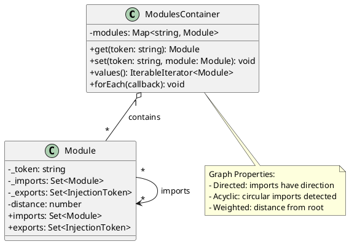

**Complexity**:
| Operation | Time Complexity |
|-----------|-----------------|
| Add Module | O(1) |
| Get Module | O(1) |
| Find All Imports | O(V + E) |
| Detect Cycles | O(V + E) |

---

### 1.2 Provider Registry

**Location**: `packages/core/injector/module.ts`

**Structure**: Multiple hash maps for different provider types

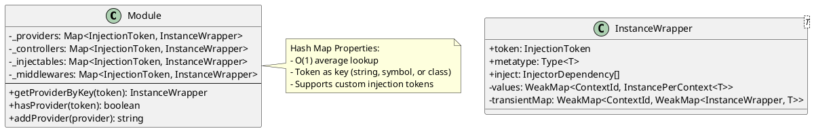

**Complexity**:
| Operation | Time Complexity |
|-----------|-----------------|
| Add Provider | O(1) average |
| Get Provider | O(1) average |
| Has Provider | O(1) average |
| List All Providers | O(n) |

---

### 1.3 Instance Cache (Scoped Instances)

**Location**: `packages/core/injector/instance-wrapper.ts`

**Structure**: WeakMap for context-based instance storage

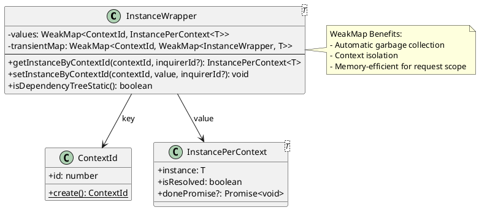

**Scoping Strategy**:
```
STATIC_CONTEXT (id=1) → Singleton instances
REQUEST_CONTEXT → Per-request instances (auto-GC when request ends)
TRANSIENT_CONTEXT → Per-injection instances (requires inquirerId)
```

---

## 2. Core Algorithms

### 2.1 Module Distance Calculation

**Location**: `packages/core/scanner.ts`

**Purpose**: Calculate topological depth of each module from root

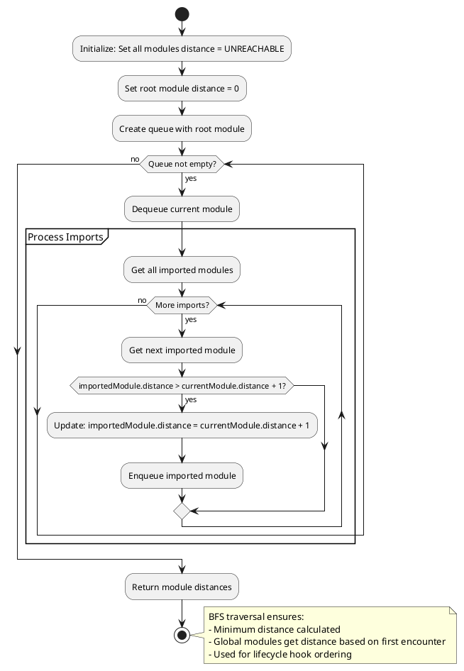

**Pseudocode**:
```
ALGORITHM CalculateModuleDistance(rootModule)
    INPUT: rootModule - the application's entry module
    OUTPUT: All modules have correct distance values

    FOR each module IN allModules DO
        module.distance = UNREACHABLE
    END FOR
    
    rootModule.distance = 0
    queue = new Queue()
    queue.enqueue(rootModule)
    
    WHILE queue is not empty DO
        current = queue.dequeue()
        
        FOR each importedModule IN current.imports DO
            IF importedModule.distance > current.distance + 1 THEN
                importedModule.distance = current.distance + 1
                queue.enqueue(importedModule)
            END IF
        END FOR
    END WHILE
```

**Complexity**: O(V + E) where V = modules, E = import relationships

---

### 2.2 Dependency Resolution (Topological Sort)

**Location**: `packages/core/injector/injector.ts`

**Purpose**: Resolve provider dependencies in correct order

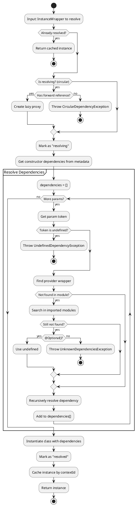

**Pseudocode**:
```
ALGORITHM ResolveDependencies(wrapper, module, contextId)
    INPUT: wrapper - InstanceWrapper to resolve
           module - containing Module
           contextId - scope context
    OUTPUT: Resolved instance

    IF wrapper.isResolved(contextId) THEN
        RETURN wrapper.getInstance(contextId)
    END IF
    
    IF wrapper.isResolving THEN
        IF hasForwardReference(wrapper) THEN
            RETURN createLazyProxy(wrapper)
        ELSE
            THROW CircularDependencyException
        END IF
    END IF
    
    wrapper.markAsResolving()
    
    dependencies = []
    params = Reflect.getMetadata('design:paramtypes', wrapper.metatype)
    injectTokens = Reflect.getMetadata(INJECT_METADATA, wrapper.metatype)
    
    FOR i = 0 TO params.length - 1 DO
        token = injectTokens[i] OR params[i]
        
        IF token IS undefined THEN
            THROW UndefinedDependencyException(i)
        END IF
        
        dependencyWrapper = lookupProvider(token, module)
        
        IF dependencyWrapper IS null THEN
            IF hasOptionalDecorator(i) THEN
                dependencies[i] = undefined
            ELSE
                THROW UnknownDependenciesException(token)
            END IF
        ELSE
            dependencies[i] = ResolveDependencies(dependencyWrapper, module, contextId)
        END IF
    END FOR
    
    instance = new wrapper.metatype(...dependencies)
    wrapper.setInstance(instance, contextId)
    wrapper.markAsResolved()
    
    RETURN instance
```

**Complexity**: O(V + E) for DAG traversal, where V = providers, E = dependencies

---

### 2.3 Provider Lookup Algorithm

**Location**: `packages/core/injector/injector.ts`

**Purpose**: Find provider across module hierarchy

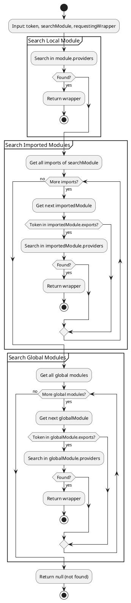

**Pseudocode**:
```
ALGORITHM LookupProvider(token, module, wrapper)
    INPUT: token - injection token
           module - starting Module
           wrapper - requesting InstanceWrapper (for error context)
    OUTPUT: InstanceWrapper or null

    // Step 1: Search local module
    IF module.providers.has(token) THEN
        RETURN module.providers.get(token)
    END IF
    
    // Step 2: Search imported modules (respect exports)
    FOR each importedModule IN module.imports DO
        IF importedModule.exports.has(token) THEN
            IF importedModule.providers.has(token) THEN
                RETURN importedModule.providers.get(token)
            END IF
            // May need recursive search for re-exported providers
            result = LookupInExportedModules(token, importedModule)
            IF result IS NOT null THEN
                RETURN result
            END IF
        END IF
    END FOR
    
    // Step 3: Search global modules
    FOR each globalModule IN container.globalModules DO
        IF globalModule.exports.has(token) THEN
            IF globalModule.providers.has(token) THEN
                RETURN globalModule.providers.get(token)
            END IF
        END IF
    END FOR
    
    RETURN null
```

**Complexity**: O(M × P) worst case, where M = modules, P = average providers per module

---

### 2.4 Guard Chain Execution

**Location**: `packages/core/guards/guards-consumer.ts`

**Purpose**: Execute guard chain and short-circuit on failure

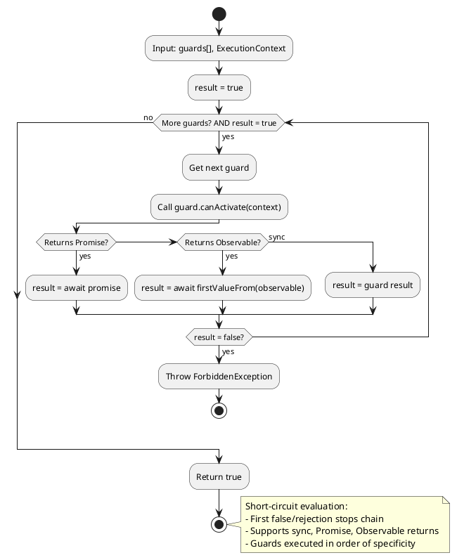

**Pseudocode**:
```
ALGORITHM ExecuteGuardChain(guards, context)
    INPUT: guards - array of CanActivate instances
           context - ExecutionContext
    OUTPUT: true if all guards pass, throws otherwise

    FOR each guard IN guards DO
        result = guard.canActivate(context)
        
        IF result IS Promise THEN
            result = AWAIT result
        ELSE IF result IS Observable THEN
            result = AWAIT firstValueFrom(result)
        END IF
        
        IF result ≠ true THEN
            THROW ForbiddenException
        END IF
    END FOR
    
    RETURN true
```

**Complexity**: O(n) where n = number of guards

---

### 2.5 Interceptor Chain (RxJS Pipeline)

**Location**: `packages/core/interceptors/interceptors-consumer.ts`

**Purpose**: Build and execute interceptor chain using RxJS

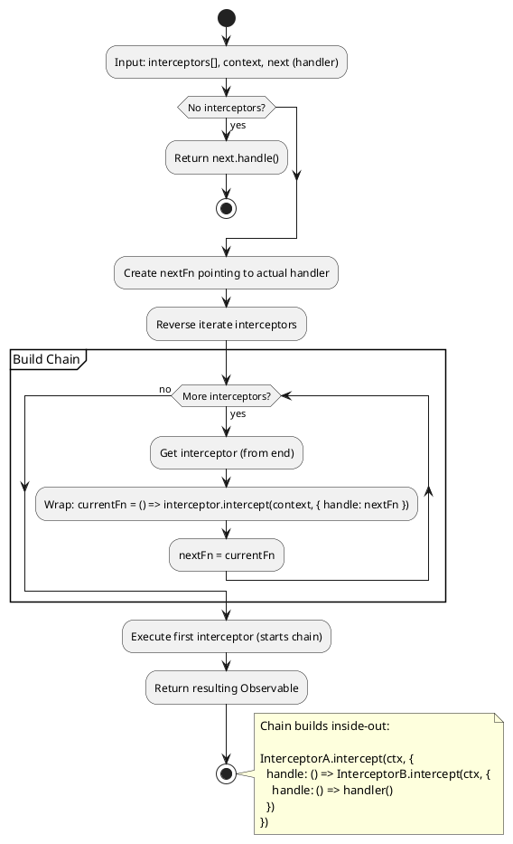

**Pseudocode**:
```
ALGORITHM BuildInterceptorChain(interceptors, context, handler)
    INPUT: interceptors - array of NestInterceptor
           context - ExecutionContext
           handler - final request handler
    OUTPUT: Observable<any>

    IF interceptors.length = 0 THEN
        RETURN defer(() => transformValue(handler()))
    END IF
    
    // Build chain from last to first
    nextFn = () => defer(() => transformValue(handler()))
    
    FOR i = interceptors.length - 1 DOWNTO 0 DO
        interceptor = interceptors[i]
        currentNextFn = nextFn
        
        nextFn = () => interceptor.intercept(context, {
            handle: () => currentNextFn()
        })
    END FOR
    
    RETURN nextFn()
```

**Complexity**: O(n) to build chain, execution depends on interceptor logic

---

### 2.6 Route Matching Algorithm

**Location**: `packages/core/router/router-explorer.ts`

**Purpose**: Match incoming request to handler

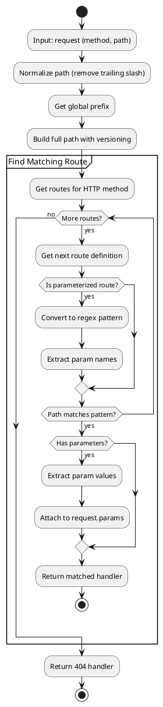

**Route Types**:
- Static: `/users` - exact match
- Parameterized: `/users/:id` - pattern match
- Wildcard: `/users/*` - prefix match
- Regex: `/users/:id(\\d+)` - custom pattern

**Complexity**: O(R) where R = number of routes for the HTTP method

---

### 2.7 Module Compilation (Dynamic Modules)

**Location**: `packages/core/injector/module-compiler.ts`

**Purpose**: Compile module class into factory with resolved dynamic metadata

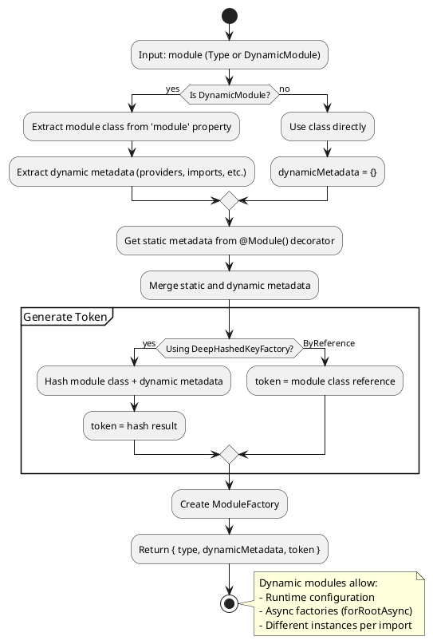

**Pseudocode**:
```
ALGORITHM CompileModule(moduleClass)
    INPUT: moduleClass - Type<any> or DynamicModule
    OUTPUT: ModuleFactory

    IF isDynamicModule(moduleClass) THEN
        type = moduleClass.module
        dynamicMetadata = {
            imports: moduleClass.imports,
            exports: moduleClass.exports,
            providers: moduleClass.providers,
            controllers: moduleClass.controllers,
        }
    ELSE
        type = moduleClass
        dynamicMetadata = {}
    END IF
    
    staticMetadata = Reflect.getMetadata(MODULE_METADATA, type)
    mergedMetadata = merge(staticMetadata, dynamicMetadata)
    
    token = moduleOpaqueKeyFactory.create(
        getModuleId(type),
        type.name,
        dynamicMetadata
    )
    
    RETURN { type, dynamicMetadata, token }
```

---

## 3. Complexity Summary

| Algorithm | Time | Space | Location |
|-----------|------|-------|----------|
| Module Distance | O(V+E) | O(V) | scanner.ts |
| Dependency Resolution | O(V+E) | O(V) | injector.ts |
| Provider Lookup | O(M×P) | O(1) | injector.ts |
| Guard Chain | O(n) | O(1) | guards-consumer.ts |
| Interceptor Chain | O(n) | O(n) | interceptors-consumer.ts |
| Route Matching | O(R) | O(1) | router-explorer.ts |
| Module Compilation | O(P) | O(P) | module-compiler.ts |

**Legend**:
- V = vertices (modules/providers)
- E = edges (imports/dependencies)
- M = number of modules
- P = average providers per module
- n = number of enhancers
- R = number of routes

---

## 4. Data Flow Diagrams

### 4.1 Request Processing Data Flow

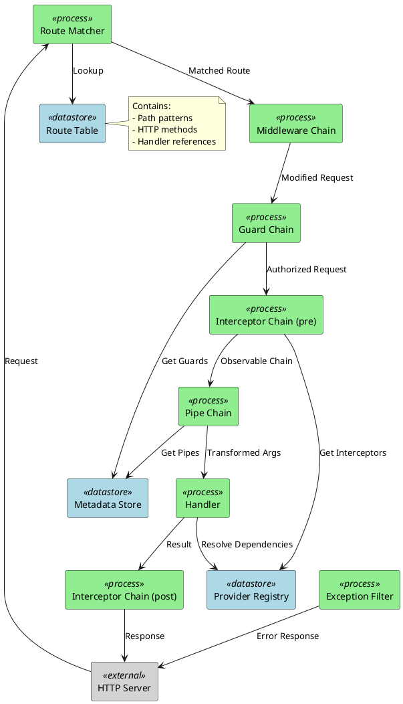

### 4.2 Dependency Injection Data Flow

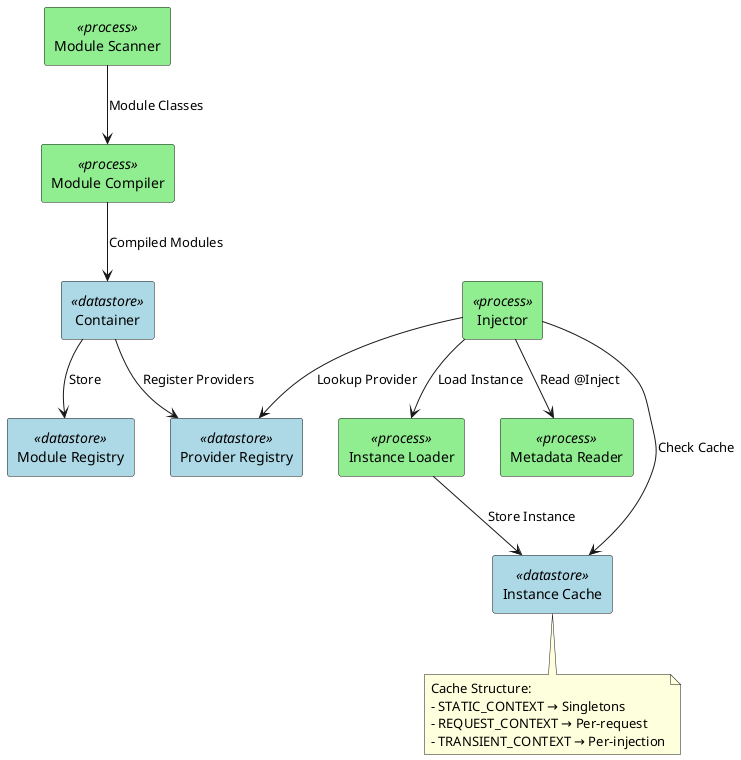

---

## 5. Performance Considerations

### 5.1 Caching Strategies

1. **Instance Caching**: WeakMap by ContextId prevents re-resolution
2. **Metadata Caching**: Decorator metadata cached by Reflect
3. **Route Caching**: Compiled routes stored at bootstrap

### 5.2 Lazy Loading

1. **Lazy Modules**: Modules can be loaded on-demand via `LazyModuleLoader`
2. **Forward References**: `forwardRef()` enables lazy dependency resolution
3. **Deferred Instantiation**: Transient providers only instantiated when requested

### 5.3 Memory Management

1. **WeakMap for Request Scope**: Auto-GC when request completes
2. **Module Tree Pruning**: Unused imports can be tree-shaken
3. **Singleton Pattern**: Reduces memory footprint for stateless services

---

## 6. References

- [Introduction to Algorithms (CLRS)](https://mitpress.mit.edu/books/introduction-algorithms-third-edition)
- [NestJS Fundamentals](https://docs.nestjs.com/fundamentals)
- [TypeScript Decorators](https://www.typescriptlang.org/docs/handbook/decorators.html)
