# Design Patterns Catalog - NestJS Framework

## Overview

This document catalogs all design patterns identified in the NestJS core framework, with precise locations, implementation details, and rationale for their use.

---

## 1. Creational Patterns

### 1.1 Factory Pattern

**Location**: `packages/core/nest-factory.ts`

**Implementation**: `NestFactoryStatic` class

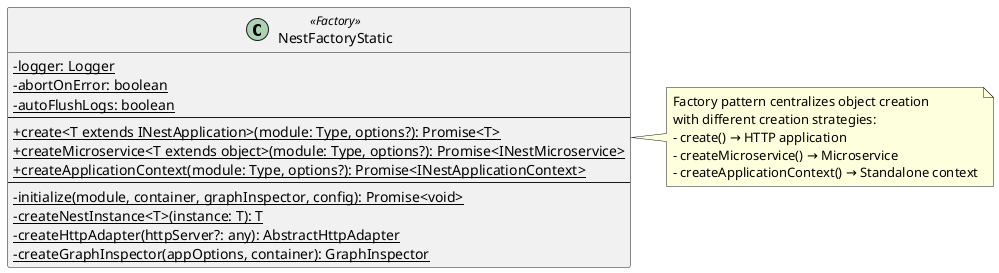

**Rationale**:
- Encapsulates complex object creation logic
- Provides multiple entry points for different application types
- Handles initialization sequence consistently

**Usage Example**:
```typescript
// HTTP Application
const app = await NestFactory.create(AppModule);

// Microservice
const microservice = await NestFactory.createMicroservice(AppModule, {
  transport: Transport.TCP,
});

// Standalone Context
const context = await NestFactory.createApplicationContext(AppModule);
```

---

### 1.2 Singleton Pattern

**Location**: `packages/core/injector/instance-wrapper.ts`

**Implementation**: Default provider scope (Scope.DEFAULT)

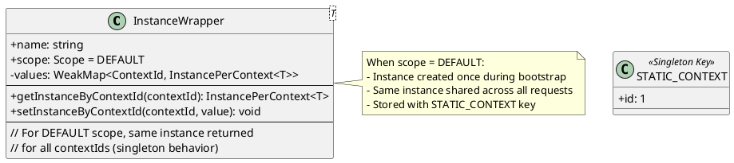

**Rationale**:
- Reduces memory footprint
- Ensures single source of truth for services
- Improves performance by avoiding repeated instantiation

**Code Reference** (`packages/core/injector/injector.ts:108-125`):
```typescript
public loadPrototype<T>(
  { token }: InstanceWrapper<T>,
  collection: Map<InstanceToken, InstanceWrapper<T>>,
  contextId = STATIC_CONTEXT,
): void {
  // Singleton instances use STATIC_CONTEXT
  const wrapper = collection.get(token);
  // ...creates prototype once for DEFAULT scope
}
```

---

### 1.3 Builder Pattern

**Location**: `packages/core/middleware/builder.ts`

**Implementation**: `MiddlewareBuilder` class

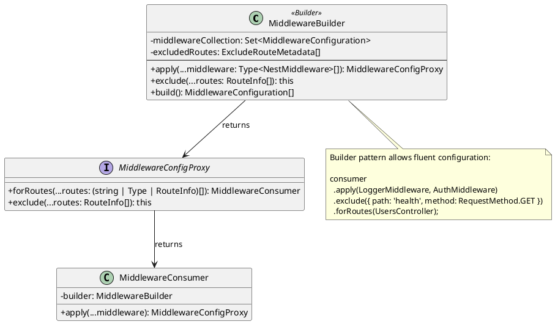

**Rationale**:
- Provides fluent API for middleware configuration
- Separates construction from representation
- Enables step-by-step configuration

**Usage Example**:
```typescript
export class AppModule implements NestModule {
  configure(consumer: MiddlewareConsumer) {
    consumer
      .apply(LoggerMiddleware)
      .exclude({ path: 'cats', method: RequestMethod.GET })
      .forRoutes(CatsController);
  }
}
```

---

## 2. Structural Patterns

### 2.1 Adapter Pattern

**Location**: `packages/core/adapters/http-adapter.ts`, `packages/platform-express/`, `packages/platform-fastify/`

**Implementation**: `AbstractHttpAdapter` and platform-specific implementations

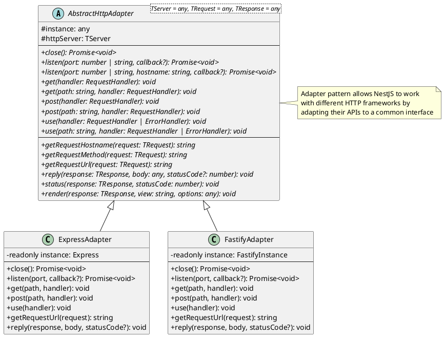

**Rationale**:
- Allows framework-agnostic core
- Enables platform switching without code changes
- Isolates platform-specific quirks

**File Locations**:
- Base adapter: `packages/core/adapters/http-adapter.ts`
- Express adapter: `packages/platform-express/adapters/express-adapter.ts`
- Fastify adapter: `packages/platform-fastify/adapters/fastify-adapter.ts`

---

### 2.2 Decorator Pattern (Gang of Four)

**Location**: `packages/core/router/router-execution-context.ts`

**Implementation**: Guards, Interceptors, Pipes wrapping handler execution

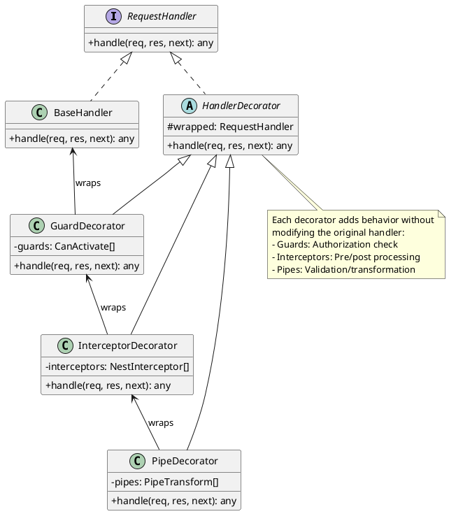

**Rationale**:
- Adds behavior dynamically
- Maintains single responsibility
- Enables flexible composition

**Code Reference** (`packages/core/router/router-execution-context.ts:79-174`):
```typescript
public create(
  instance: Controller,
  callback: (...args: any[]) => unknown,
  methodName: string,
  moduleKey: string,
  requestMethod: RequestMethod,
  contextId?: ContextId,
  inquirerId?: string,
): (...args: any[]) => Promise<any> {
  // Creates decorated handler chain
  const guards = this.guardsContextCreator.create(/*...*/);
  const interceptors = this.interceptorsContextCreator.create(/*...*/);
  const pipes = this.pipesContextCreator.create(/*...*/);
  // ... combines into execution pipeline
}
```

---

### 2.3 Proxy Pattern

**Location**: `packages/core/router/router-proxy.ts`

**Implementation**: `RouterProxy` class

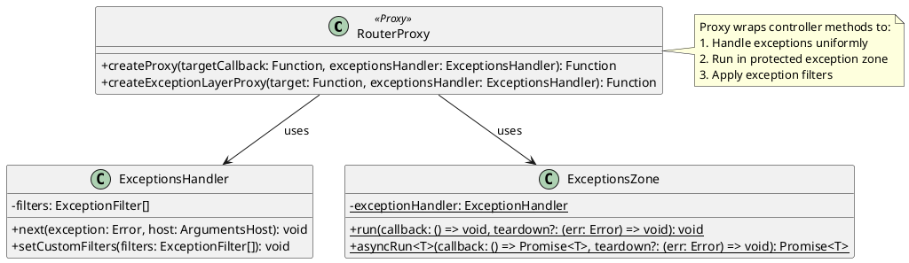

**Rationale**:
- Adds exception handling transparently
- Controls access to actual handler
- Provides execution zone protection

**Code Reference** (`packages/core/router/router-proxy.ts:8-28`):
```typescript
public createProxy(
  targetCallback: RouterProxyCallback,
  exceptionsHandler: ExceptionsHandler,
) {
  return async <TRequest, TResponse>(
    req: TRequest,
    res: TResponse,
    next: () => void,
  ) => {
    try {
      await targetCallback(req, res, next);
    } catch (e) {
      exceptionsHandler.next(e, new ExecutionContextHost([req, res, next]));
    }
  };
}
```

---

### 2.4 Facade Pattern

**Location**: `packages/core/nest-application.ts`

**Implementation**: `NestApplication` class

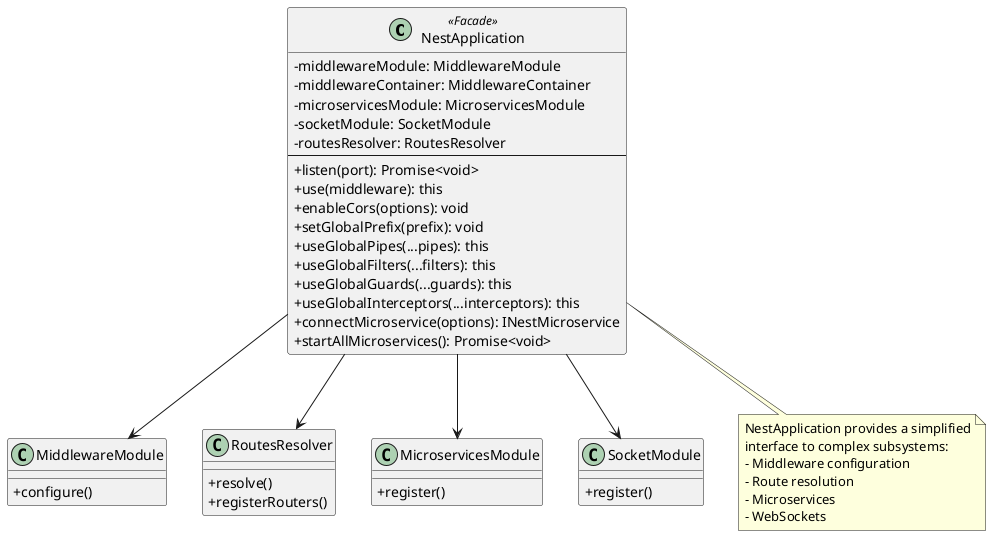

**Rationale**:
- Simplifies framework usage
- Hides complex initialization
- Provides unified configuration API

---

### 2.5 Composite Pattern

**Location**: `packages/core/injector/modules-container.ts`

**Implementation**: Module tree structure

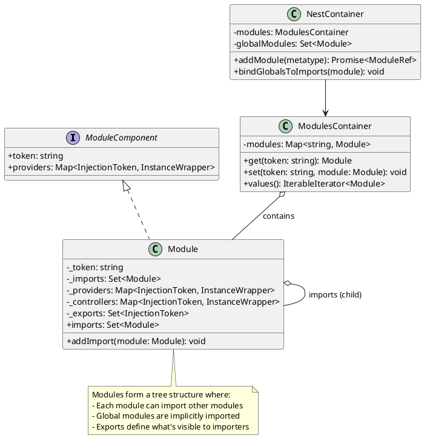

**Rationale**:
- Represents module hierarchy
- Enables uniform treatment of modules
- Supports recursive composition

---

## 3. Behavioral Patterns

### 3.1 Chain of Responsibility Pattern

**Location**: `packages/core/middleware/middleware-module.ts`, `packages/core/guards/guards-consumer.ts`

**Implementation**: Middleware chain, Guard chain, Interceptor chain

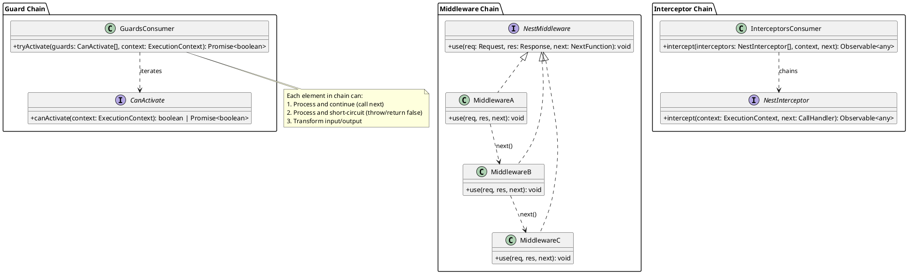

**Rationale**:
- Decouples sender from receivers
- Allows dynamic chain configuration
- Each handler has single responsibility

**Code Reference** (`packages/core/guards/guards-consumer.ts:11-28`):
```typescript
public async tryActivate(
  guards: CanActivate[],
  context: ExecutionContext,
  instance: Controller,
  callback: (...args: any[]) => any,
): Promise<boolean> {
  for (const guard of guards) {
    const result = guard.canActivate(context);
    if (await this.pickResult(result) !== true) {
      throw new ForbiddenException(FORBIDDEN_MESSAGE);
    }
  }
  return true;
}
```

---

### 3.2 Strategy Pattern

**Location**: `packages/core/injector/opaque-key-factory/`

**Implementation**: Module token generation strategies

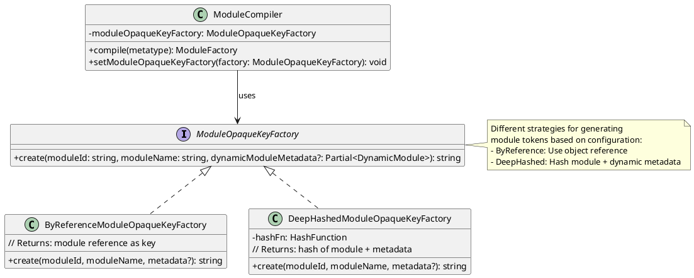

**Rationale**:
- Allows different module identification strategies
- Encapsulates algorithm variations
- Enables runtime strategy selection

**File Locations**:
- Interface: `packages/core/injector/opaque-key-factory/interfaces/module-opaque-key-factory.interface.ts`
- By Reference: `packages/core/injector/opaque-key-factory/by-reference-module-opaque-key-factory.ts`
- Deep Hashed: `packages/core/injector/opaque-key-factory/deep-hashed-module-opaque-key-factory.ts`

---

### 3.3 Observer Pattern

**Location**: `packages/core/hooks/`

**Implementation**: Lifecycle hooks (OnModuleInit, OnModuleDestroy, etc.)

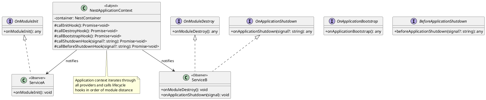

**Rationale**:
- Loose coupling between framework and services
- Enables initialization/cleanup logic
- Supports graceful shutdown

**Code Reference** (`packages/core/hooks/on-module-init.hook.ts`):
```typescript
export async function callModuleInitHook(module: Module): Promise<void> {
  const providers = module.getNonAliasProviders();
  const [_, moduleClassHost] = providers.shift();
  const instances = [...providers, moduleClassHost];
  
  await Promise.all(
    this.mapToInitPromise(instances),
  );
}
```

---

### 3.4 Template Method Pattern

**Location**: `packages/core/helpers/context-creator.ts`

**Implementation**: `ContextCreator` abstract class

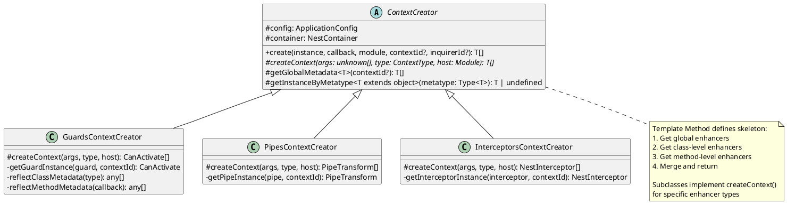

**Rationale**:
- Defines algorithm skeleton
- Allows subclasses to customize steps
- Avoids code duplication

**Code Reference** (`packages/core/helpers/context-creator.ts`):
```typescript
public abstract class ContextCreator {
  public create(
    instance: Controller,
    callback: Function,
    module: string,
    contextId?: ContextId,
    inquirerId?: string,
  ): T[] {
    const globalMetadata = this.getGlobalMetadata<T[]>(contextId);
    const classMetadata = this.reflectClassMetadata<T>(type);
    const methodMetadata = this.reflectMethodMetadata<T>(callback);
    // Template algorithm - merge all metadata
    return [...globalMetadata, ...classMetadata, ...methodMetadata];
  }
  
  protected abstract createContext(...): T[];
}
```

---

### 3.5 Command Pattern

**Location**: `packages/core/repl/` (REPL Commands)

**Implementation**: REPL native functions

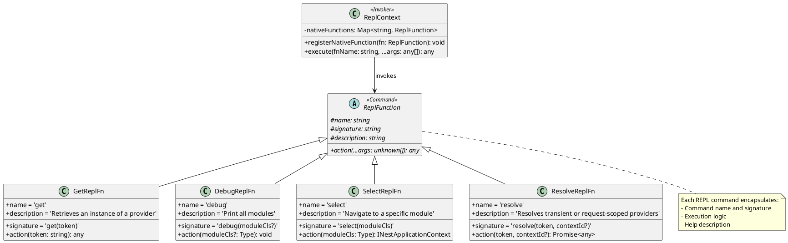

**Rationale**:
- Encapsulates request as object
- Allows parameterization
- Supports undo/redo (potential)

**File Locations**:
- `packages/core/repl/native-functions/get-repl-fn.ts`
- `packages/core/repl/native-functions/debug-repl-fn.ts`
- `packages/core/repl/native-functions/select-relp-fn.ts`
- `packages/core/repl/native-functions/resolve-repl-fn.ts`

---

### 3.6 Visitor Pattern

**Location**: `packages/core/metadata-scanner.ts`

**Implementation**: `MetadataScanner` class

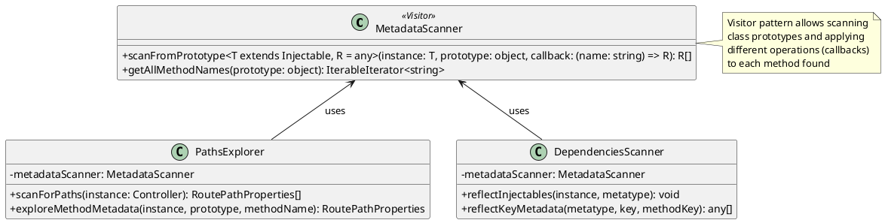

**Rationale**:
- Separates algorithm from object structure
- Adds operations without modifying classes
- Enables metadata extraction from decorators

**Code Reference** (`packages/core/metadata-scanner.ts:12-34`):
```typescript
public scanFromPrototype<T extends Injectable, R = any>(
  instance: T,
  prototype: object,
  callback: (name: string) => R,
): R[] {
  const methodNames = this.getAllMethodNames(prototype);
  return iterate(methodNames)
    .filter(method => !isConstructor(method) && isFunction(prototype[method]))
    .map(callback)
    .toArray();
}
```

---

## 4. Architectural Patterns

### 4.1 Dependency Injection / Inversion of Control

**Location**: `packages/core/injector/`

**Implementation**: `Injector`, `NestContainer`, `InstanceWrapper`

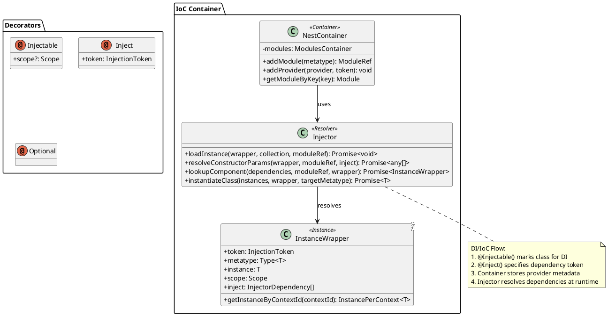

**Core Implementation Files**:
- Container: `packages/core/injector/container.ts`
- Injector: `packages/core/injector/injector.ts`
- Instance Wrapper: `packages/core/injector/instance-wrapper.ts`
- Module: `packages/core/injector/module.ts`

---

### 4.2 Module Pattern

**Location**: `packages/common/decorators/modules/module.decorator.ts`

**Implementation**: `@Module()` decorator and `Module` class

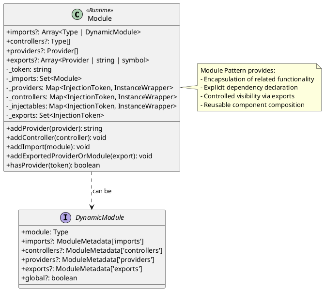

**Rationale**:
- Organizes application into cohesive blocks
- Explicit dependency declaration
- Controlled visibility through exports
- Supports lazy loading

---

## 5. Summary Table

| Pattern | Type | Location | Purpose |
|---------|------|----------|---------|
| Factory | Creational | `nest-factory.ts` | Application creation |
| Singleton | Creational | `instance-wrapper.ts` | Provider scoping |
| Builder | Creational | `builder.ts` | Middleware configuration |
| Adapter | Structural | `http-adapter.ts` | Platform abstraction |
| Decorator (GoF) | Structural | `router-execution-context.ts` | Pipeline enhancement |
| Proxy | Structural | `router-proxy.ts` | Exception handling |
| Facade | Structural | `nest-application.ts` | Simplified API |
| Composite | Structural | `modules-container.ts` | Module hierarchy |
| Chain of Responsibility | Behavioral | `guards-consumer.ts` | Request processing |
| Strategy | Behavioral | `opaque-key-factory/` | Token generation |
| Observer | Behavioral | `hooks/` | Lifecycle events |
| Template Method | Behavioral | `context-creator.ts` | Enhancer creation |
| Command | Behavioral | `repl/` | REPL commands |
| Visitor | Behavioral | `metadata-scanner.ts` | Metadata extraction |
| Dependency Injection | Architectural | `injector/` | IoC container |
| Module | Architectural | `module.decorator.ts` | Encapsulation |

---

## 6. References

- [Gang of Four Design Patterns](https://en.wikipedia.org/wiki/Design_Patterns)
- [NestJS Architecture](https://docs.nestjs.com/fundamentals/custom-providers)
- [Martin Fowler's Patterns of Enterprise Application Architecture](https://martinfowler.com/eaaCatalog/)
