# Low-Level Design: NestJS Core Architecture

## 1. Overview

This document provides a comprehensive low-level architectural analysis of the NestJS core framework. NestJS is a progressive Node.js framework for building efficient, reliable, and scalable server-side applications built with TypeScript.

### 1.1 Design Goals

- **Modularity**: Encapsulate functionality into cohesive, reusable modules
- **Extensibility**: Allow customization through decorators, providers, and middleware
- **Dependency Injection**: Provide a powerful IoC container for managing dependencies
- **Platform Agnosticism**: Support multiple HTTP adapters (Express, Fastify)
- **Type Safety**: Leverage TypeScript for compile-time type checking

### 1.2 Package Structure

```
packages/
├── common/          # Decorators, interfaces, DTOs, pipes, guards
├── core/            # IoC container, router, application lifecycle
├── microservices/   # Message-based communication
├── platform-express/# Express HTTP adapter
├── platform-fastify/# Fastify HTTP adapter
├── platform-socket.io/ # Socket.IO WebSocket adapter
├── platform-ws/     # WS WebSocket adapter
├── testing/         # Testing utilities
└── websockets/      # WebSocket gateway support
```

---

## 2. Core Architecture Components

### 2.1 C4 Container Diagram

```plantuml
@startuml C4_NestJS_Container
!include https://raw.githubusercontent.com/plantuml-stdlib/C4-PlantUML/master/C4_Container.puml

LAYOUT_WITH_LEGEND()

title Container Diagram - NestJS Framework

Person(developer, "Developer", "Builds applications using NestJS")

System_Boundary(nestjs, "NestJS Framework") {
    Container(factory, "NestFactory", "TypeScript", "Application bootstrap and factory")
    Container(container, "NestContainer", "TypeScript", "IoC Container - manages modules and dependencies")
    Container(injector, "Injector", "TypeScript", "Dependency injection engine")
    Container(scanner, "DependenciesScanner", "TypeScript", "Scans modules for metadata")
    Container(router, "RoutesResolver", "TypeScript", "HTTP route registration")
    Container(middleware, "MiddlewareModule", "TypeScript", "Middleware chain management")
    Container(app, "NestApplication", "TypeScript", "HTTP application instance")
    ContainerDb(metadata, "Metadata Storage", "Reflect.metadata", "Stores decorator metadata")
}

System_Ext(express, "Express/Fastify", "HTTP Adapter")

Rel(developer, factory, "Uses")
Rel(factory, container, "Creates")
Rel(factory, scanner, "Uses to scan")
Rel(scanner, container, "Populates")
Rel(container, injector, "Provides to")
Rel(injector, metadata, "Reads from")
Rel(factory, app, "Creates")
Rel(app, router, "Uses")
Rel(app, middleware, "Uses")
Rel(router, container, "Resolves from")
Rel(app, express, "Adapts to")

@enduml
```

### 2.2 C4 Component Diagram - Core Package

```plantuml
@startuml C4_NestJS_Component
!include https://raw.githubusercontent.com/plantuml-stdlib/C4-PlantUML/master/C4_Component.puml

LAYOUT_WITH_LEGEND()

title Component Diagram - @nestjs/core Package

Container_Boundary(core, "@nestjs/core") {
    Component(factory, "NestFactoryStatic", "Class", "Bootstrap application instances")
    Component(app, "NestApplication", "Class", "HTTP application with lifecycle management")
    Component(appContext, "NestApplicationContext", "Class", "Standalone application context")
    
    Component(container, "NestContainer", "Class", "IoC container holding modules")
    Component(module, "Module", "Class", "Module wrapper with providers/controllers")
    Component(wrapper, "InstanceWrapper", "Class", "Provider instance wrapper with scoping")
    Component(injector, "Injector", "Class", "Dependency resolution engine")
    Component(compiler, "ModuleCompiler", "Class", "Module compilation and tokenization")
    
    Component(scanner, "DependenciesScanner", "Class", "Module/provider scanning")
    Component(metascanner, "MetadataScanner", "Class", "Metadata extraction from classes")
    
    Component(resolver, "RoutesResolver", "Class", "Route registration coordinator")
    Component(explorer, "RouterExplorer", "Class", "Controller method exploration")
    Component(execContext, "RouterExecutionContext", "Class", "Request handler factory")
    
    Component(guardsCreator, "GuardsContextCreator", "Class", "Guard chain creation")
    Component(pipesCreator, "PipesContextCreator", "Class", "Pipe chain creation")
    Component(interceptorsCreator, "InterceptorsContextCreator", "Class", "Interceptor chain creation")
    Component(filtersCreator, "BaseExceptionFilterContext", "Class", "Exception filter chain creation")
    
    Component(middlewareModule, "MiddlewareModule", "Class", "Middleware configuration")
}

Rel(factory, container, "Creates")
Rel(factory, scanner, "Uses")
Rel(factory, app, "Creates")

Rel(app, resolver, "Uses")
Rel(app, middlewareModule, "Uses")

Rel(container, module, "Stores")
Rel(module, wrapper, "Contains")
Rel(injector, wrapper, "Resolves")
Rel(injector, container, "Queries")

Rel(scanner, container, "Populates")
Rel(scanner, metascanner, "Uses")

Rel(resolver, explorer, "Uses")
Rel(explorer, execContext, "Uses")

Rel(execContext, guardsCreator, "Uses")
Rel(execContext, pipesCreator, "Uses")
Rel(execContext, interceptorsCreator, "Uses")

@enduml
```

---

## 3. Dependency Injection System

### 3.1 Class Diagram - IoC Container

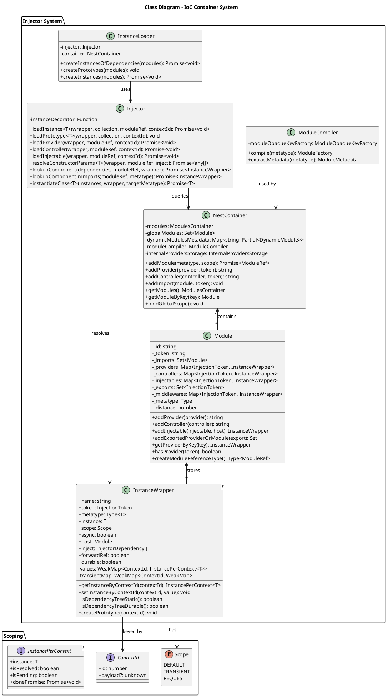

### 3.2 Sequence Diagram - Dependency Resolution

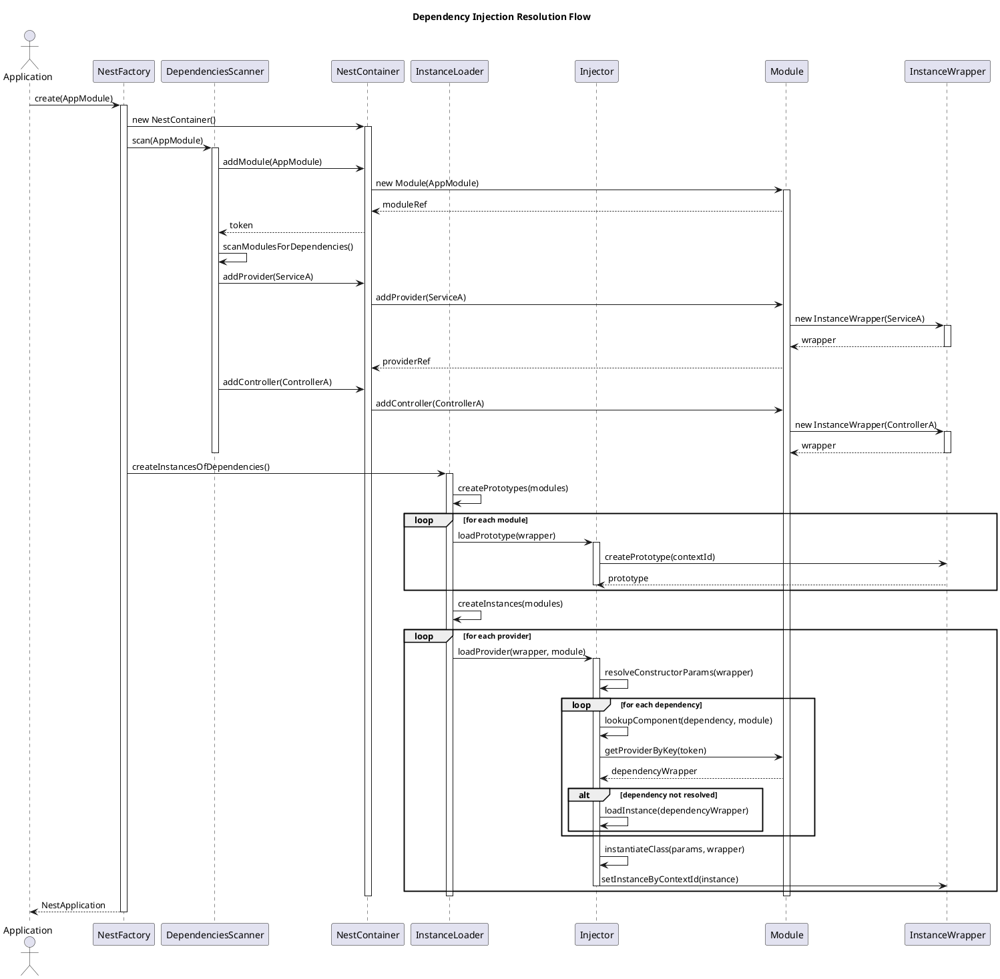

### 3.3 Provider Scoping Strategy

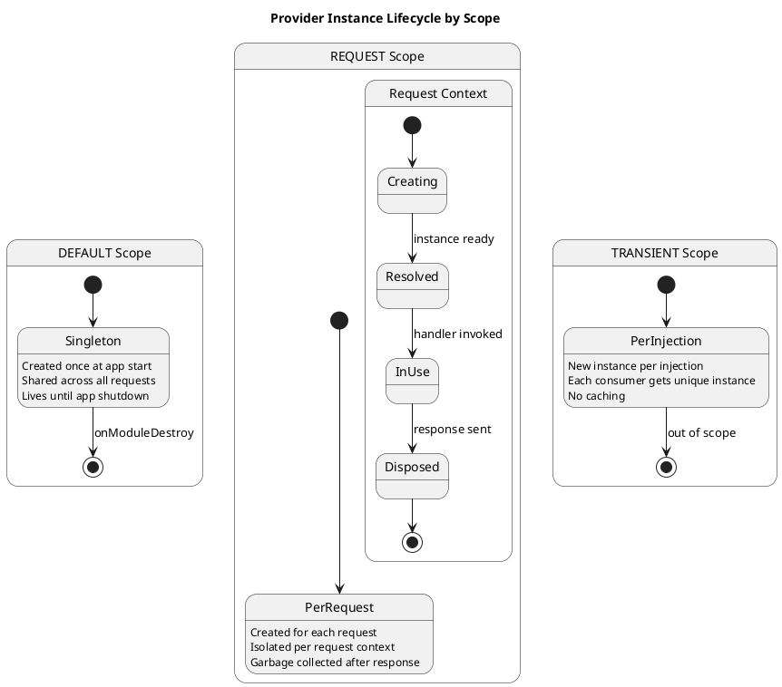

---

## 4. Request Processing Pipeline

### 4.1 Class Diagram - Router System

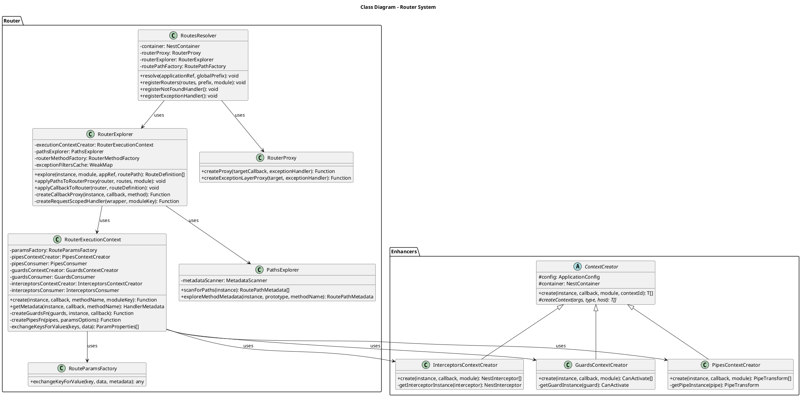

### 4.2 Sequence Diagram - Request Handler Execution

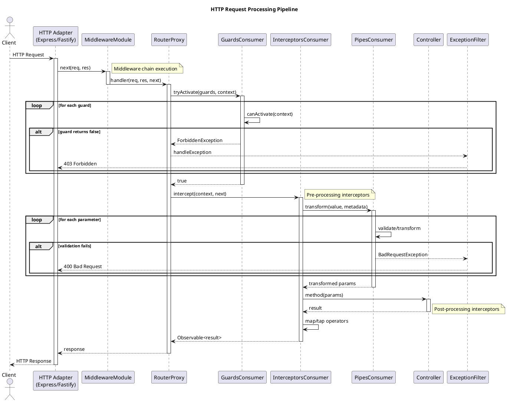

### 4.3 Activity Diagram - Request Flow

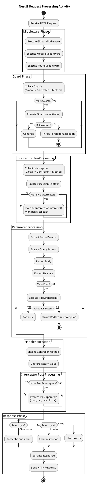

---

## 5. Design Patterns Implemented

### 5.1 Factory Pattern - NestFactory

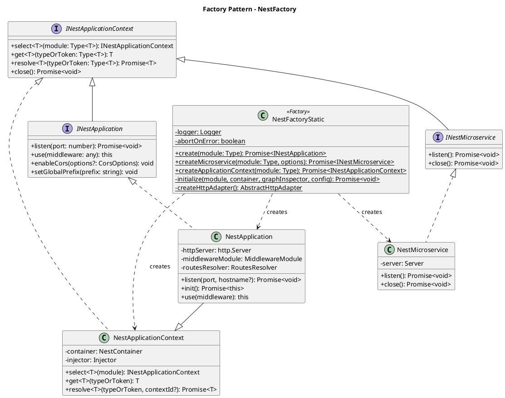

### 5.2 Decorator Pattern - Request Pipeline Enhancers

```plantuml
@startuml Pattern_Decorator
skinparam classAttributeIconSize 0

title Decorator Pattern - Pipeline Enhancers

interface CanActivate {
    +canActivate(context: ExecutionContext): boolean | Promise<boolean> | Observable<boolean>
}

interface NestInterceptor<T, R> {
    +intercept(context: ExecutionContext, next: CallHandler<T>): Observable<R>
}

interface PipeTransform<T, R> {
    +transform(value: T, metadata: ArgumentMetadata): R
}

interface ExceptionFilter<T> {
    +catch(exception: T, host: ArgumentsHost): void
}

class AuthGuard implements CanActivate {
    +canActivate(context): boolean
}

class RolesGuard implements CanActivate {
    +canActivate(context): boolean
}

class LoggingInterceptor implements NestInterceptor {
    +intercept(context, next): Observable
}

class TransformInterceptor implements NestInterceptor {
    +intercept(context, next): Observable
}

class ValidationPipe implements PipeTransform {
    +transform(value, metadata): any
}

class ParseIntPipe implements PipeTransform {
    +transform(value, metadata): number
}

class HttpExceptionFilter implements ExceptionFilter {
    +catch(exception, host): void
}

note bottom of CanActivate
  Guards "decorate" the handler
  by adding authorization checks
end note

note bottom of NestInterceptor
  Interceptors "decorate" the handler
  with pre/post processing logic
end note

note bottom of PipeTransform
  Pipes "decorate" parameters
  with transformation/validation
end note

@enduml
```

### 5.3 Strategy Pattern - HTTP Adapters

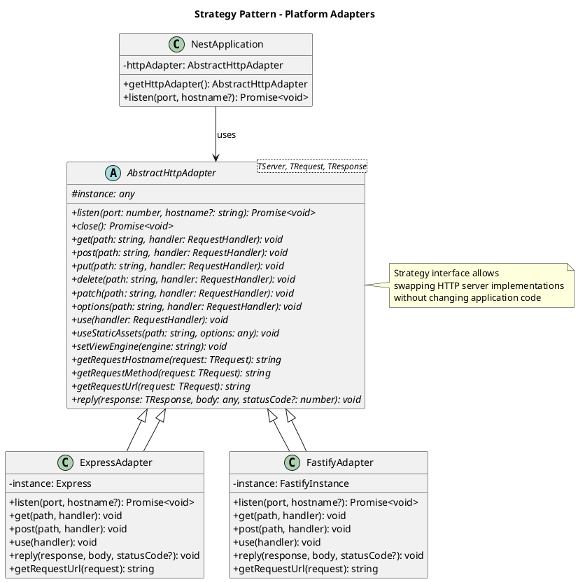

### 5.4 Observer Pattern - Lifecycle Hooks

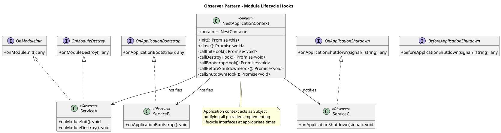

### 5.5 Chain of Responsibility - Middleware/Guards/Interceptors

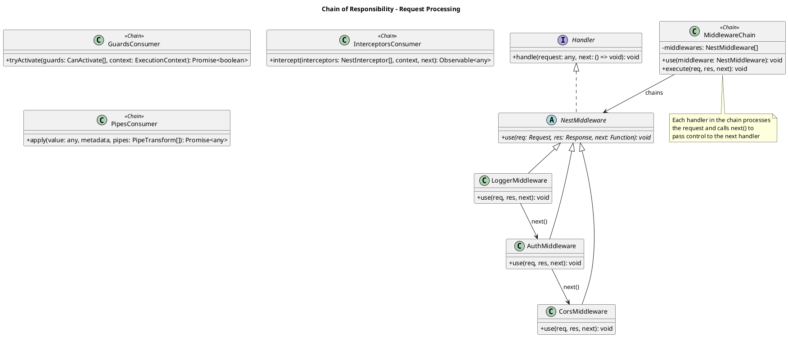

### 5.6 Proxy Pattern - RouterProxy

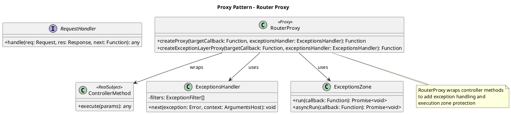

---

## 6. Module System Architecture

### 6.1 Module Compilation Flow

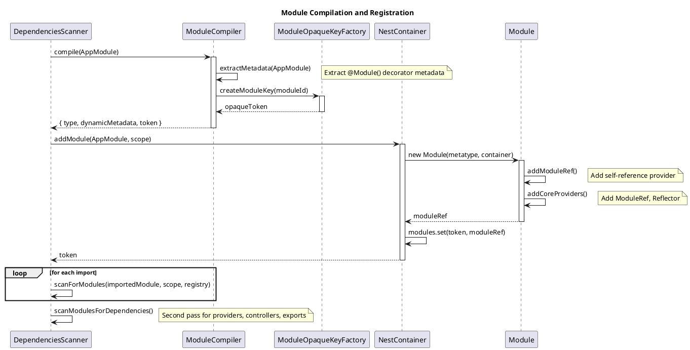

### 6.2 Dynamic Module Structure

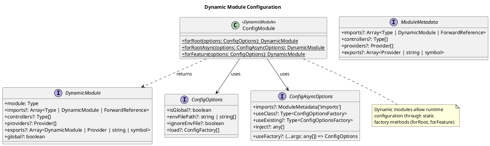

---

## 7. Error Handling Architecture

### 7.1 Exception Hierarchy

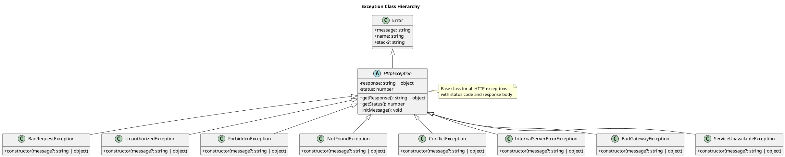

### 7.2 Exception Filter Chain

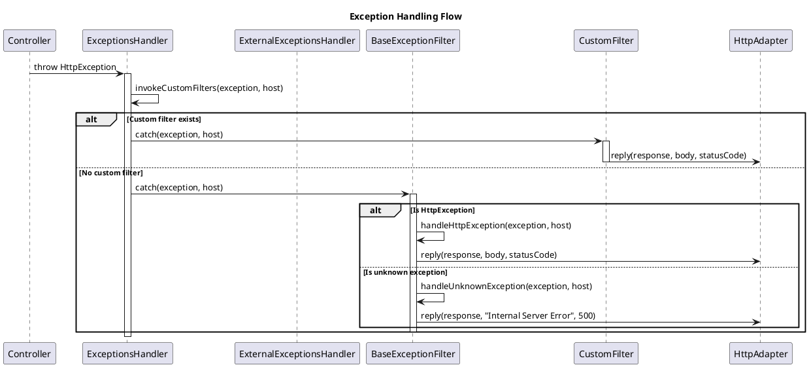

---

## 8. Metadata Reflection System

### 8.1 Decorator Metadata Flow

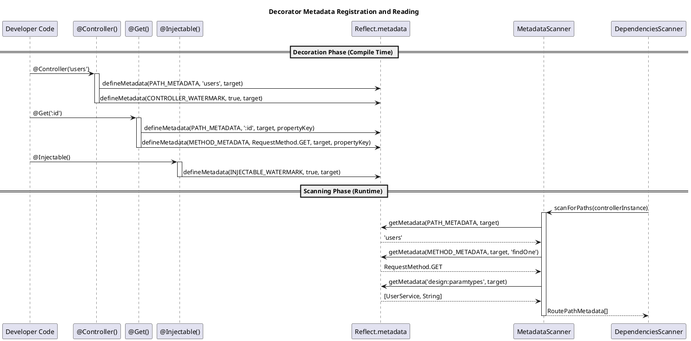

### 8.2 Custom Decorator Creation

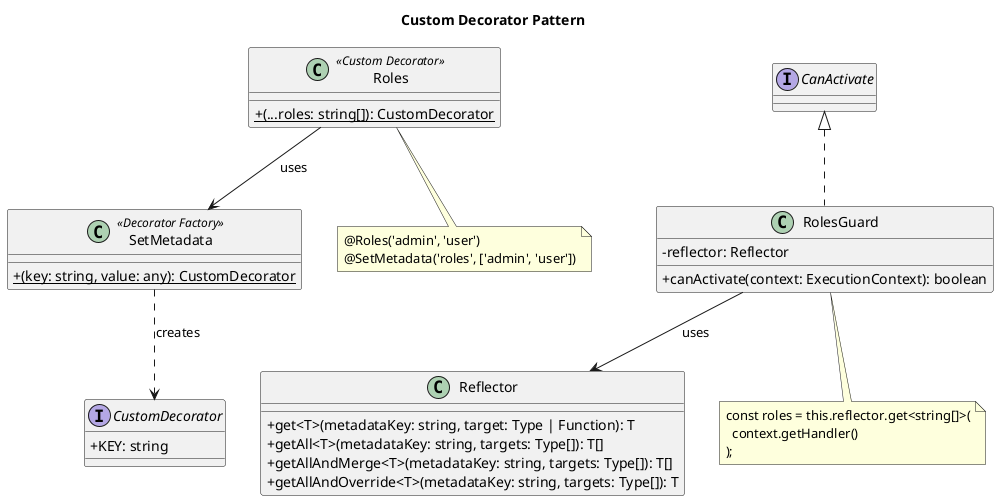

---

## 9. Communication Diagram

### 9.1 Application Bootstrap Communication

```plantuml
@startuml Communication_Bootstrap
title Application Bootstrap Object Communication

object "NestFactory" as Factory
object "NestContainer" as Container
object "DependenciesScanner" as Scanner
object "InstanceLoader" as Loader
object "Injector" as Injector
object "NestApplication" as App
object "RoutesResolver" as Routes
object "MiddlewareModule" as Middleware
object "GraphInspector" as Inspector

Factory --> Container : 1: create
Factory --> Scanner : 2: create
Factory --> Inspector : 3: create
Factory --> Scanner : 4: scan(module)
Scanner --> Container : 5: addModule
Scanner --> Container : 6: addProvider
Scanner --> Container : 7: addController
Factory --> Loader : 8: createInstances
Loader --> Injector : 9: loadInstance
Injector --> Container : 10: resolve
Factory --> App : 11: create
App --> Routes : 12: resolve
App --> Middleware : 13: configure
Routes --> Container : 14: getControllers
Routes --> Inspector : 15: inspect

@enduml
```

---

## 10. State Machine - Application Lifecycle

```plantuml
@startuml State_Application_Lifecycle
title NestJS Application Lifecycle States

[*] --> Initializing : NestFactory.create()

state Initializing {
    [*] --> CreatingContainer
    CreatingContainer --> ScanningModules : container ready
    ScanningModules --> CompilingModules : modules scanned
    CompilingModules --> LoadingDependencies : modules compiled
    LoadingDependencies --> ResolvingRoutes : dependencies loaded
    ResolvingRoutes --> ConfiguringMiddleware : routes resolved
    ConfiguringMiddleware --> [*] : middleware configured
}

Initializing --> Ready : init() complete

state Ready {
    [*] --> Idle
    Idle --> Listening : listen()
    Listening --> ProcessingRequest : request received
    ProcessingRequest --> Listening : response sent
}

Ready --> ShuttingDown : close() / SIGTERM

state ShuttingDown {
    [*] --> BeforeShutdown
    BeforeShutdown: beforeApplicationShutdown()
    BeforeShutdown --> OnShutdown : complete
    OnShutdown: onApplicationShutdown()
    OnShutdown --> ModuleDestroy : complete
    ModuleDestroy: onModuleDestroy()
    ModuleDestroy --> Cleanup : complete
    Cleanup --> [*] : resources released
}

ShuttingDown --> [*] : shutdown complete

@enduml
```

---

## 11. Algorithms

### 11.1 Module Distance Calculation

```
ALGORITHM CalculateModulesDistance
  INPUT: modules: Map<string, Module>, rootModule: Module
  OUTPUT: void (modules are mutated with distance values)
  
  1. SET rootModule.distance = 0
  2. SET queue = [rootModule]
  3. SET visited = new Set([rootModule.token])
  
  4. WHILE queue is not empty:
     a. SET current = queue.shift()
     b. FOR EACH importedModule IN current.imports:
        i.  IF importedModule.token NOT IN visited:
            - ADD importedModule.token TO visited
            - SET importedModule.distance = current.distance + 1
            - PUSH importedModule TO queue
  
  5. RETURN
```

### 11.2 Dependency Resolution Algorithm

```
ALGORITHM ResolveDependency
  INPUT: wrapper: InstanceWrapper, moduleRef: Module, contextId: ContextId
  OUTPUT: resolvedInstance: T
  
  1. IF wrapper.isResolved(contextId):
     RETURN wrapper.getInstanceByContextId(contextId)
  
  2. SET dependencies = getConstructorDependencies(wrapper.metatype)
  
  3. FOR EACH dependency IN dependencies:
     a. SET depWrapper = lookupComponent(dependency, moduleRef)
     
     b. IF depWrapper IS NULL:
        i.  SET depWrapper = lookupComponentInImports(moduleRef, dependency)
        
     c. IF depWrapper IS NULL:
        THROW UnknownDependenciesException
     
     d. IF NOT depWrapper.isResolved(contextId):
        CALL ResolveDependency(depWrapper, depWrapper.host, contextId)
  
  4. SET resolvedDeps = dependencies.map(d => d.instance)
  
  5. SET instance = instantiateClass(resolvedDeps, wrapper.metatype)
  
  6. CALL wrapper.setInstanceByContextId(contextId, instance)
  
  7. RETURN instance
```

### 11.3 Guard Chain Execution

```
ALGORITHM TryActivateGuards
  INPUT: guards: CanActivate[], context: ExecutionContext
  OUTPUT: boolean
  
  1. FOR i = 0 TO guards.length - 1:
     a. SET guard = guards[i]
     b. SET result = guard.canActivate(context)
     
     c. IF result IS Promise:
        SET result = AWAIT result
        
     d. IF result IS Observable:
        SET result = AWAIT firstValueFrom(result)
     
     e. IF result IS FALSE:
        THROW ForbiddenException
  
  2. RETURN TRUE
```

---

## 12. Quality Attributes

### 12.1 Design Principles Applied

| Principle | Implementation |
|-----------|----------------|
| **Single Responsibility** | Each class has one reason to change (Injector resolves, Scanner scans, Router routes) |
| **Open/Closed** | Framework extensible via decorators, middleware, guards without modification |
| **Liskov Substitution** | HTTP adapters are interchangeable (Express/Fastify) |
| **Interface Segregation** | Small focused interfaces (CanActivate, PipeTransform, NestInterceptor) |
| **Dependency Inversion** | High-level modules depend on abstractions (AbstractHttpAdapter) |

### 12.2 Extensibility Points

1. **Custom Decorators** - Extend metadata system
2. **Custom Providers** - Factory, Value, Class, Existing providers
3. **Custom Middleware** - Request preprocessing
4. **Custom Guards** - Authorization logic
5. **Custom Interceptors** - Cross-cutting concerns
6. **Custom Pipes** - Validation/Transformation
7. **Custom Exception Filters** - Error handling
8. **Custom HTTP Adapters** - Platform support

---

## 13. References

- [NestJS Official Documentation](https://docs.nestjs.com/)
- [NestJS GitHub Repository](https://github.com/nestjs/nest)
- [TypeScript Decorators](https://www.typescriptlang.org/docs/handbook/decorators.html)
- [Reflect Metadata](https://github.com/rbuckton/reflect-metadata)
- [Dependency Injection Pattern](https://martinfowler.com/articles/injection.html)
